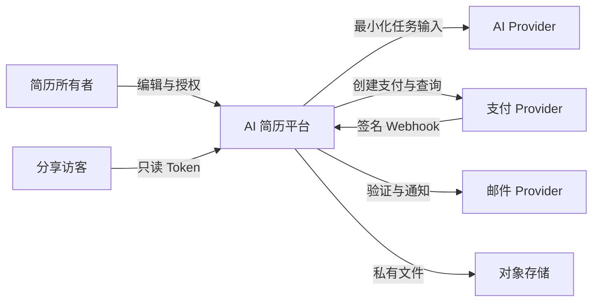
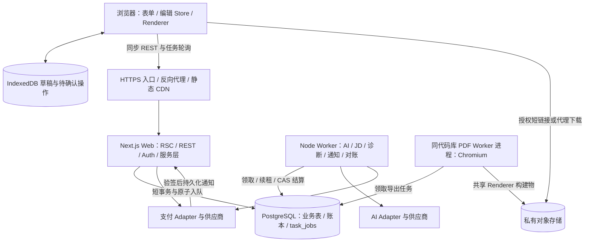
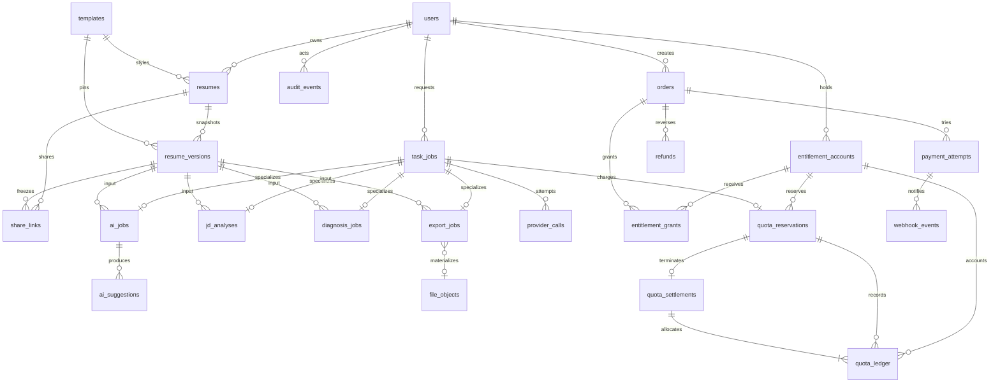
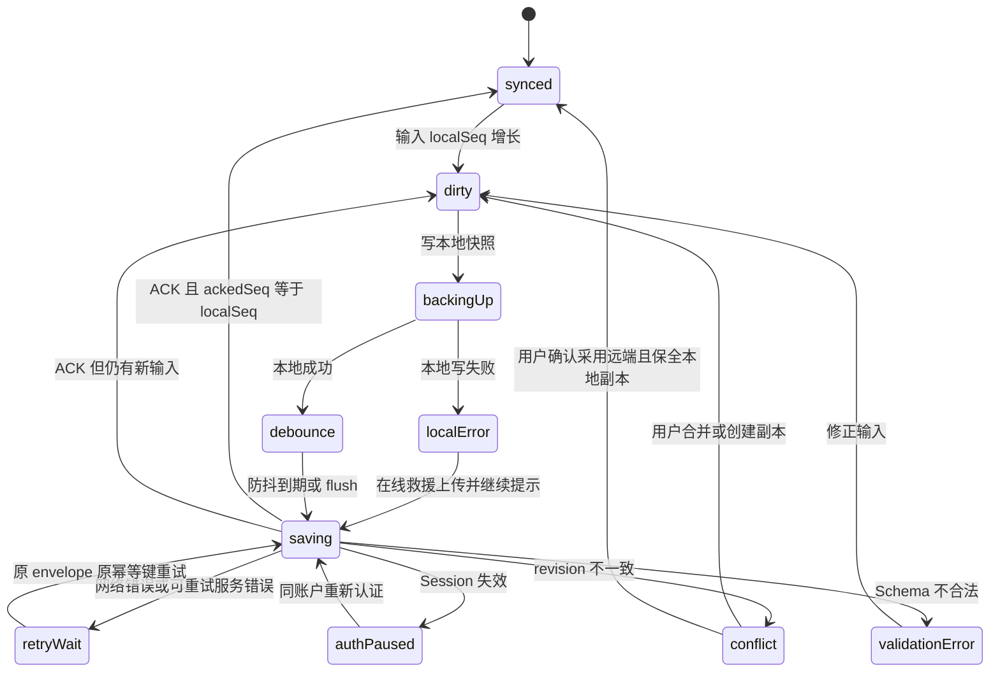
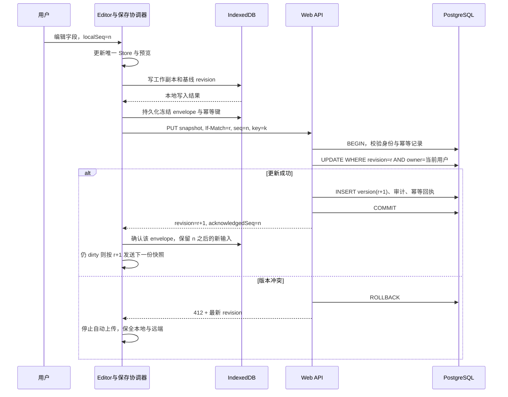
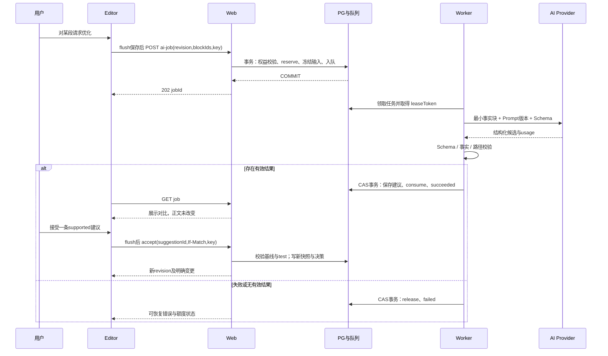
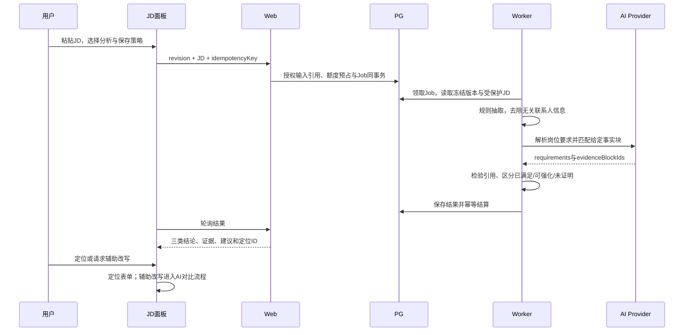
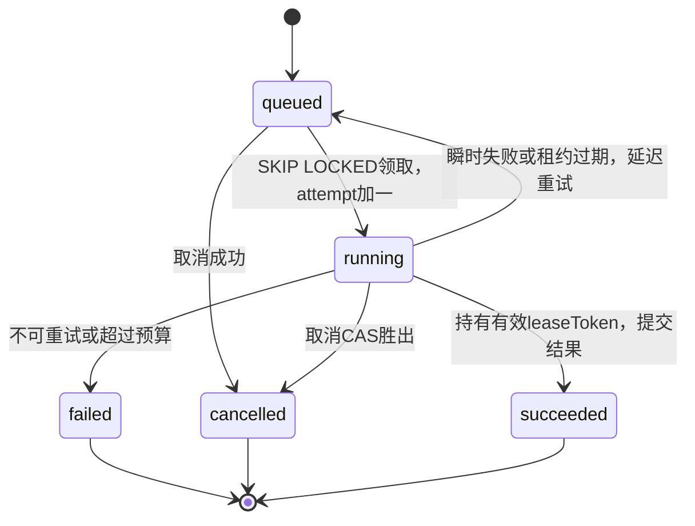
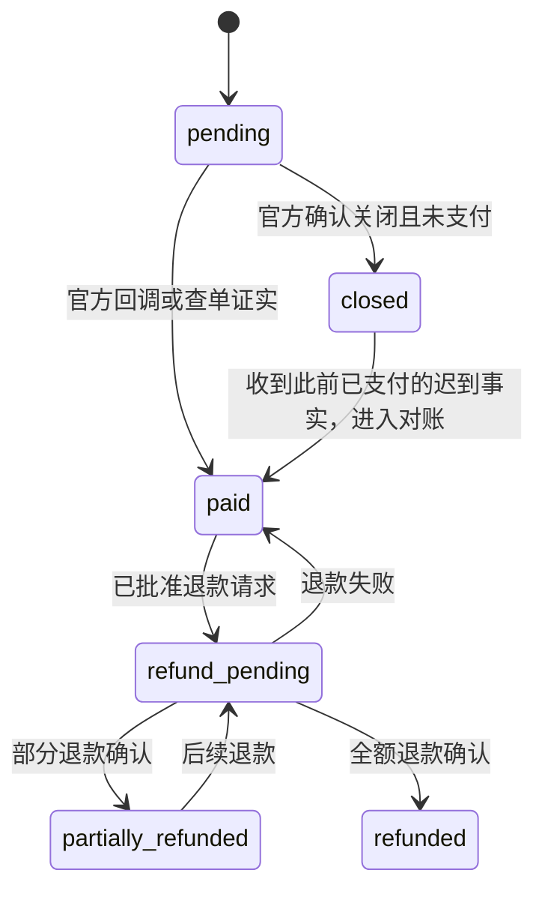
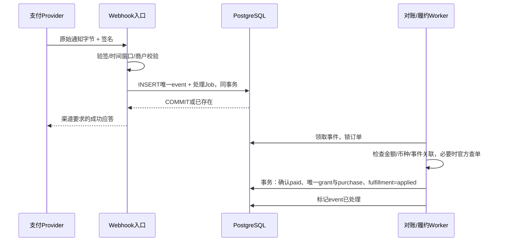

# AI 简历平台技术选型文档

## 1. 文档信息

| 项目 | 内容 |
| --- | --- |
| 文档版本 | V0.3，2026-09-17；记录用户确认的产品条件与商业规则，不变更首选架构 |
| 文档状态 | 产品边界、基础计费及会员到期规则已确认；架构仍须按验证门槛验收，商品价格/数量、续购细节与退款细则待关闭 |
| 适用产品版本 | 正式产品 V0.1—V1.0；与图片交互原型的版本号分别管理 |
| 目标读者 | 技术负责人、前后端工程师、测试、产品、运维及安全负责人 |
| 产品依据 | [product-design.md](./product-design.md)，尤其第 14—18、21—23 节 |
| 视觉依据 | [design.mf](./design.mf)；产品文档引用的 `design.md` 当前未提供，实际以此文件为准 |
| 交互依据 | [ux-interaction-spec.md](./ux-interaction-spec.md) 的 7 条主流程、失败恢复和 Overlay 规则 |
| 原型依据 | [prototype-test/src/prototype.ts](./prototype-test/src/prototype.ts)、[prototype-test/src/App.tsx](./prototype-test/src/App.tsx)、[prototype-test/package.json](./prototype-test/package.json) |
| 外部资料 | 架构资料于 2026-09-16 查询，CI/CD、压测、备份资料于 2026-09-17 补核；第三方功能、地区、限额、许可证和价格须在版本锁定及上线前复核 |

用户于2026-09-17确认：中国大陆首发；个人独立开发，技术栈不受现有技能限制、运维能力强；时间与预算充足，但没有给出具体日期或金额；首期仅交付V0.1编辑、保存、预览。当前架构假设仍为首期单区域部署、单写PostgreSQL；无多人实时协作、无公开第三方API；简历是有界的结构化文档；自定义内容为文本和受限链接，不支持用户执行模板代码。用户规模、峰值并发、预算金额、RPO/RTO、SLO仍需测量或批准，不能把“充足”解释为无限资源。

按桌面端优先设计，1440px 是产品设计基准；支持常见笔记本及手机只读、分享、下载与有限轻量修改。以少量受控 ATS 友好模板启动，具体数量 TBD。V0.1 使用仅限本地/内网的服务端固定测试身份；公开测试前必须切换为邮箱密码及邮箱验证，手机号登录首期不实现。

| 尚未确定的业务决策 | 本文采用的开发处理方式 | 决策责任与截止点 |
| --- | --- | --- |
| 运营主体、付费商户资格 | 首发地区已确定中国大陆；主体/商户仍需确认，不默认跨境传输 | 产品/运营，选购生产资源前 |
| 会员价格与赠额、有效期内续购细节、退款细则 | 注册赠5次且永久有效；AI优化/JD匹配/诊断各次成功扣1；失败返还、重新生成成功扣1；会员开通固定三年，到期未续费失去高级能力；剩余付费额度保留用于基础功能均已确认 | 产品/财务，相关计费能力及V0.5收款前 |
| 模板数、付费模板、分享限制 | 会员到期后查看/编辑/下载保留已确认；不得用未续费锁住已有简历或其下载 | 产品，V0.2/付费前 |
| JD 默认保存、AI 原文/建议留存期限 | 临时输入与业务保存分离；配置未批准时禁止真实用户公开上线 | 产品/安全，V0.4 前 |
| 分享密码、有效期和下载策略 | 首期实现只读、撤销、有效期字段、禁止下载权限位；密码能力后置 | 产品/安全，分享上线前 |
| 历史版本留存、注销宽限期、账务留存 | 独立保留策略；法律要求与用户内容分别处理 | 产品/安全/财务，真实数据测试前 |
| 数据用于模型改进 | 本架构默认不用于训练或产品改进；如变更须独立业务决策 | 产品/安全，任何相关用途启用前 |
| 品牌、ATS 表述、AI 内容标识适用性 | 文案不宣称真实 ATS 得分；保留 AI 来源和标识策略接口 | 产品/合规，V1.0 前 |

### 1.1 本次补充的效力与交付定位

本次保持原有 25 章和 ADR。四类交付标准分别见：第 7.4—7.8 节接口、第 14.5 节权限、第 15.4—15.6 节商业规则；第 20.1—20.5 节工程与流水线；第 17.1—17.4 节性能及边界验收；第 18.1 节告警及第 19.4—19.8 节运行手册。

“必须”表示开发验收要求；“建议基线”是本次提出的工程参数，不是实测结果、用户规模或对外 SLA；“待审批业务参数”不得由开发自行填成真实价格或上线规则。接口、脚本、OpenAPI、流水线和运行命令在本文定义的是**正式工程待实现的交付契约**，不表示当前原型已经具备。缺文件、缺命令、无测试数据或配置未批准都按未交付处理，不能用空脚本、跳过测试或 mock 成功报告替代。

每项发布证据关联 `commitSha、imageDigest、schemaVersion、migrationVersion、policyVersion、environment、runId、approver、timestamp`。非商业工程基线可以随压测修订，但必须更新本文、对应配置、测试阈值和变更记录；禁止只放宽 CI 参数。

本文配套[结构校验脚本](./scripts/validate-technical-selection.mjs)，在仓库根执行 `node scripts/validate-technical-selection.mjs`。它只验证文档章节、表格、示例JSON、覆盖项和流水线基本约束，不替代正式工程的契约测试、部署、压测或恢复演练。

### 1.2 用户已确认条件与本期实施边界

| 决策 | 已确认内容 | 实施含义 |
| --- | --- | --- |
| 市场与组织 | 中国大陆首发、个人独立开发、运维能力强 | 境内数据路径为主线；海外部署章节仅作未来迁移备选；复杂度按单人可持续维护评估 |
| 首期范围 | V0.1：固定测试简历的结构化编辑、保存、预览 | 包含服务端固定开发身份、所有权边界、模块管理、本地恢复、版本/CAS、基础撤销和测试；不做登录、工作台、CRUD、AI、JD、诊断、PDF生产导出、会员收款；仅限本地/内网测试 |
| 时间与资源 | 时间与预算充足，具体上限未给出 | 可以充分验证可靠性，不据此引入微服务/Kubernetes或无限采购 |
| 注册赠送 | 注册成功后一次性赠送5次AI使用机会，免费额度不过期 | 统一ai_use单位，grant数量5、valid_to=null；策略升级/注册回调重试不得再次赠送 |
| 成功计费 | AI优化、JD匹配、简历诊断分别每次消耗1次 | 一个用户提交的逻辑任务成功扣1，不按内部模型调用次数扣费 |
| 失败与重生成 | 生成失败返还；用户点击重新生成且成功扣1 | reserve=1；成功consume=1；失败release=1；自动技术重试不新增收费任务 |
| 会员权益 | 更多AI额度，以及更完整诊断/JD功能；开通后固定三年，到期未续费才取消会员 | 会员资格、额度余额、功能能力分别建模；不因三年内未充值提前取消；赠额数量/价格/基础与高级功能清单待定 |
| 到期保护 | 会员到期后简历仍可查看、编辑、下载 | 到期只限制会员专属能力，不删除正文、不禁用基础下载 |
| 付费余额 | 会员到期后剩余付费AI额度保留，可用于基础功能；高级功能仍需有效会员 | 到期不清零、不冻结额度；余额大于0不自动获得高级功能资格 |
| 仍待决策 | 会员价格/赠额、提前续购和充值产品、基础/高级功能清单、退款细则 | 不擅自让普通额度充值续期会员；不影响V0.1编辑/保存/预览实施 |

记录用户商业意图不等于全部技术ADR已经验收；当前推荐架构保持不变。V0.1先验证保存/恢复与实时预览，再按第21节递进。AI额度账本在V0.3实现，V0.1不为未来计费提前增加收款入口；V0.3上线前确定是否为早期V0.1注册用户补发一次性赠额，不能偷偷重复发或漏发。

个人开发意味着产品、研发、运维可以由同一人承担，但自动测试不能被“本人熟悉所有技术”替代。独立复核没有实际人员时如实标记缺失；V0.1内部测试可使用受控手动发布和重新认证，真实数据公开上线/资金操作的独立安全及财务复核安排在对应门禁前落实，不虚构两名审批人。

## 2. 执行摘要

唯一首选是 Next.js App Router 模块化单体，配独立 Node.js Worker、PostgreSQL、Drizzle 和对象存储，以 Docker 为通用部署单元。编辑器采用 React、Zustand/Immer、React Hook Form/Zod、TanStack Query 与 Dexie；正文使用 Resume JSONB、revision 和不可变快照。预览与 Playwright Chromium PDF 共用版本化 Renderer。AI 通过 Provider Adapter 输出带证据的建议，人工接受后才写入；额度与支付以数据库事务、不可变账本和幂等约束保证一致性。队列首选 PostgreSQL 任务表，避免首期增加 Redis。当前不采用独立 NestJS、微服务、Kubernetes、向量数据库或 LangChain/LangGraph。最大风险是保存竞态造成误覆盖、分页与字体不一致、AI 无证据改写和支付/额度重复结算，需在各版本发布前通过故障测试。

## 3. 需求与技术约束

| 需求 | 技术约束与验收方向 |
| --- | --- |
| 注册、登录、多简历管理 | 用户隔离；会话失效可恢复原任务；创建、复制、删除、重命名有清晰结果 |
| 结构化填写、显隐、排序、实时预览 | 单一内容契约；隐藏只改变显示属性；空模块不输出标题；排序不重建 ID |
| 自动保存与历史 | 输入立即可见、本地备份、服务端 ACK 后才显示已保存；拒绝最后写入者静默覆盖；恢复产生新版本 |
| AI 优化和对比 | 原文、建议、理由、证据状态齐备；未证明内容不能一键应用；支持逐条拒绝和撤销 |
| JD 与诊断 | JD 是岗位要求，不是个人经历证据；区分已满足、可强化、未证明；定位至稳定条目 ID |
| 模板和 PDF | A4、多页、中文字体、相同版本可复现；不以截图 PDF 作为正式输出 |
| 分享、下载 | 默认私有、主动开启、可撤销；访客只读；文件下载临时授权；关闭链接后后续访问被拒绝 |
| 额度和支付 | 服务端检查、预占、有效结果后扣减、失败返还；Webhook 与权益激活均幂等 |
| 隐私 | 禁止完整正文、JD、密码和支付凭证进入日志；支持用户数据导出、注销和删除 |
| 可访问性 | Tab/Enter/Space、Esc、焦点圈、图标名称、Tooltip、文字错误、拖拽替代及非纯颜色差异 |
| 设备与视觉 | 黑灰分层、小圆角、细边框、白色 A4；桌面编辑器优先；手机不强行缩成完整三栏 |

性能目标采用输入响应、保存确认、任务排队和导出耗时的实测基线；正式 SLO 由压测及用户测试制定。产品原文要求保存接近完全可靠、PDF 阻断性差异为零，本方案将其落实为发布门槛，不承诺尚无测量支持的百分比。

MVP 不做微服务、Kubernetes、多人协同、向量数据库、自由 Canvas、大型模板市场、App/小程序、自动投递、自动续费和任意 Word 无损导入。身份校验、数据隔离、备份和幂等从首个相关版本开始，不推迟到 V1.0。

## 4. 架构方案对比

评分是本项目的架构判断，不是第三方性能测评。每项 1—5 分，5 为最有利；权重之和 100，总分为 `Σ(权重 × 分数) / 5`。可靠性与支付评分包含在该方案下实现本项目一致性边界的难度，不能理解为某框架自动保证业务正确。

| 维度 | 权重 | A：Next.js 单体 + Worker + PG | B：Vite + NestJS + Worker | C：Vite + Supabase/Edge | D：微服务 |
| --- | ---: | ---: | ---: | ---: | ---: |
| MVP 开发速度 | 14 | 5 | 3 | 5 | 1 |
| 编辑器适配 | 12 | 5 | 5 | 5 | 4 |
| 数据可靠性 | 16 | 5 | 5 | 4 | 3 |
| AI/PDF 任务适配 | 12 | 5 | 5 | 2 | 5 |
| 支付幂等 | 12 | 5 | 5 | 3 | 3 |
| 安全和隐私 | 12 | 4 | 4 | 4 | 3 |
| 运维成本 | 8 | 4 | 3 | 4 | 1 |
| 中国大陆部署 | 6 | 4 | 5 | 2 | 4 |
| 供应商锁定低 | 4 | 4 | 5 | 2 | 4 |
| 后续扩展 | 4 | 4 | 5 | 3 | 5 |
| 加权总分 / 100 | **100** | **93.2** | **88.8** | **73.2** | **62.0** |

- **A 唯一首选**：网站页面、鉴权入口和 API 共用一套 TypeScript 工程，适合当前个人独立开发的维护边界；编辑器是客户端应用，不受 RSC 交互限制；账务和任务入队可以位于同一个 PostgreSQL 事务。Worker 隔离浏览器和模型长任务。代价是要明确缓存与服务器/客户端边界。
- B 的独立 API 很适合已有 NestJS 团队或多客户端平台，但当前没有这些证据；首期增加部署、认证转发和契约协调工作。只有独立 API 团队、第三方 API 或多终端持续演进成为真实需求时迁移，纯粹流量增长先扩 Web/Worker。
- C 能快速拼出 CRUD，但 Edge Functions 的执行时间、CPU 和运行环境限制不适合作为本项目 Chromium PDF 的唯一执行器；关键账务跨多次前端 API 调用也不能自动成事务。加独立 Worker 和事务服务后已经向 A 的结构靠拢。此处否定的是“全部业务依赖 Edge/BaaS”的组合，不是否定 Supabase PostgreSQL。[Supabase 函数限制](https://supabase.com/docs/guides/functions/limits)
- D 引入跨服务事务、重复事件、部署和追踪复杂度；当前缺乏独立团队边界收益。模块化单体允许 Web 与 Worker 独立扩容，不等于所有任务必须塞入一个进程。

若团队已有成熟 NestJS 资产，应重评速度权重与迁移成本；在现有文件提供的条件下维持 A，不同时建设两个首选后端。

## 5. 总体架构

系统上下文：



容器级架构：



客户端负责输入、即时预览、排序、面板、差异展示、未同步提示与本地操作历史。服务端负责所有权、合法 Schema、revision、额度、价格、订单、建议接受校验、文件授权、分享撤销。浏览器不得持有数据库、AI、对象存储管理或支付密钥。

同步边界为校验、查询、保存快照、接受已生成建议、创建订单记录和创建任务。异步边界为 AI、JD、完整诊断、PDF、邮件通知、退款执行、支付对账及数据清理。外部 HTTP 调用不持有数据库事务锁。任务 API 在数据库提交后返回 `202 + jobId`，MVP 用有退避的轮询，不以页面持续连接保证任务完成。

Web 和 Worker 共用领域服务与契约，但独立入口、连接池和资源限额。最小部署可把两个进程放在同一主机不同容器，PDF 用独立进程并发池；资源竞争明显时移至单独主机，不拆领域服务。

## 6. 前端技术选型

### 6.1 框架与 UI

正式版选择 Next.js App Router + React + TypeScript。工作台首屏、账户、方案介绍和只读入口可由 Server Component 取得已授权 DTO；编辑器入口下是 Client Component，承载 Store、DOM 测量、IndexedDB 和交互。客户端组件不等于文件任意访问浏览器对象：只在客户端生命周期初始化持久化，避免 SSR/hydration 不一致。供应商密钥、数据库及业务服务标记为 server-only。[Next.js 组件边界](https://nextjs.org/docs/app/getting-started/server-and-client-components)

选择 Tailwind CSS 管理产品外壳和 Token，选择基于 Radix 的 shadcn/ui 组件作为可维护源码，统一 Dialog、Tooltip、Tabs、Select、AlertDialog。简历 Renderer 使用单独 CSS，不继承编辑器样式和 Tailwind preflight；容器可通过隔离样式边界避免污染。正式框架版本从受支持稳定版本锁定，React/Next 必须配套验证；不复制原型旧锁文件，也不使用浮动 `latest`。

### 6.2 状态分工

| 状态 | 首选 | 规则 |
| --- | --- | --- |
| 当前简历工作副本、localSeq、ackRevision、撤销历史 | Zustand + Immer | 文档唯一客户端权威副本；按字段/模块 selector 订阅；不得对每次键入重绘所有页面 |
| touched、错误、IME 组合输入及暂未完成字段 | React Hook Form + Zod | 以字段 change/compositionend 形成领域命令；草稿允许空值，不因“未填完整”拒绝保存 |
| 服务端简历列表、模板目录、Job、订单、权益 | TanStack Query | 缓存 DTO、轮询和失效；后台 refetch 只更新远端基线，不 `reset()` 覆盖本地 dirty 文档 |
| 左右面板、选中工具、弹窗、缩放 | 局部 React state 或 UI Store | 与正文历史隔离；收起面板不卸载文档 Store |
| 离线草稿、待确认保存 envelope | Dexie / IndexedDB | 按账户、简历和标签页隔离，刷新后恢复 |

TanStack Query 默认存在 stale/refetch 行为；编辑器必须显式控制，不能把“服务器最新返回值”直接当作用户工作副本。保存的重试由专用协调器负责，关闭 mutation 隐式重试以免形成双重重试。[Query 默认行为](https://tanstack.com/query/latest/docs/framework/react/guides/important-defaults)

RHF 不保存第二份完整 Resume；对活动模块维护表单视图，程序化恢复或 AI 接受以明确 revision 事件同步。表单校验拆为“可保存草稿”和“可导出/可生成”两级，禁止为了合法邮箱而丢弃用户尚未输完的邮箱字符串。

### 6.3 保存、撤销和输入响应

采用第 10 节的保存协调器：输入同步进入 Store，随后写 IndexedDB，再防抖上传快照。同一简历同一标签页只允许一个未确认保存请求。初始防抖建议 800ms、本地写入合并建议 200ms，均为可调工程起点而非产品 SLA；切字段、失焦和进入 AI/PDF 前 flush。

Immer 正向/逆向 patch 只服务客户端撤销栈，不是 HTTP 保存协议。按一次输入事务、一次排序、一次建议接受分组；中文组合输入作为一组；新编辑清空 redo。原生输入撤销与文档级快捷键必须统一路由，不能一次 Ctrl+Z 执行两套撤销。版本恢复/跨设备重载后重置当前会话栈，历史版本仍保留。

### 6.4 本地草稿、拖拽与访问性

Dexie 保存 `{userId,resumeId,tabId,baseRevision,baseSnapshot,workingSnapshot,localSeq,ackedSeq,pendingEnvelope,updatedAt}`。写入成功与云端成功分别显示；quota exceeded、私密模式、浏览器回收存储必须显式警告并提供本地 JSON 救援导出。持久存储申请不是绝对保障，IndexedDB 也不是备份服务。[Dexie 存储持久性说明](https://dexie.org/docs/StorageManager)

dnd-kit 用于模块/条目排序，保留 pointer 与 keyboard sensor、屏幕阅读器移动播报、取消拖动和上移/下移按钮；按稳定 ID 重排数组，不按索引重新生成条目。锁定时验证实际采用的 dnd-kit API 代际，避免混用新版与旧版文档。[dnd-kit 可访问性指导](https://dndkit.com/legacy/guides/accessibility/)

Dialog 打开时移入焦点、限制 Tab 在弹窗内循环、Esc 关闭、关闭后还原触发焦点；背景不可操作。AI 差异使用“原文/建议”“新增/删除”标签和文字，不能只标红绿。异步结果用克制的 aria-live，排序和定位后聚焦目标表单；有未保存数据时关闭页面由离开保护处理。

### 6.5 路由与迁移

正式路由为 `/login`、`/resumes`、`/resumes/new`、`/resumes/:id/edit`、`/resumes/:id/diagnosis`、`/membership`、`/orders/:id`、`/s/:token`。模块与工具选择可用 URL 参数保存，参数只能含内部 ID/工具类型；简历内容和完整 JD 不进入 URL。分享、导出、额度不足为真实 Overlay；左右折叠和 AI loading/compare 属同一编辑器状态。

可复用原型的视觉基线、状态名称、7 条任务脚本、操作事件意图和已记录的可用性反馈。必须重写透明热点布局、图片正文、固定计时器、登录假校验、复制/导出模拟、AI 写入、账本及支付流程。当前 27 张图片和 24 个整页状态只是参考资产；没有用户测试数据就不能称交互已经用户验证，4 个原型测试也不构成正式系统验收。

## 7. 后端与 API 选型

### 7.1 模块与协议

模块化单体分为 Auth、Resume/Version、Template/Rendering、AI、JD/Diagnosis、Job、Entitlement/Quota、Order/Payment、Sharing/File、Audit/Privacy。模块通过应用服务调用，不在 Route Handler 中直接拼接跨模块业务。事务由应用服务开启，并把同一 `tx` 交给各仓储；模块不能私自启动第二个连接事务。

采用 REST JSON + OpenAPI，Zod 为请求/响应契约源。与 tRPC 相比，REST 更便于异构支付回调、脚本、Worker 及未来客户端；GraphQL 对当前固定文档和任务接口没有必要收益。tRPC 不是不能用，而是当前不值得增加专用协议绑定。无需独立 NestJS。

Route Handler 处理 HTTP、Session、输入边界、状态码和应用服务调用；Server Action 只用于非核心轻量表单外壳，仍执行同样鉴权与 CSRF 检查；自动保存、任务、订单统一使用可重放 REST。普通服务层拥有事务、不变量和 Provider 调度。RSC 读取时直接调用授权查询服务，不绕路 HTTP 请求自己。

### 7.2 请求契约

- 所有私有资源先验证 Session，再用服务端 userId 查询资源所有权；不接受客户端指定 ownerId。不可见资源返回统一 404，避免枚举。
- 写请求用 `Idempotency-Key`，数据库 `idempotency_requests` 唯一键为 `(user_id, operation, key)`，保存 canonical request hash、状态、结果资源 ID 与必要响应。相同键不同请求体返回 409 `IDEMPOTENCY_KEY_REUSED`；重放前重新检查身份和资源未删除。付款/账本的领域唯一约束不随短期 HTTP 幂等记录过期。
- `PUT document` 要求 `If-Match: "revision"`；缺失返回 428，版本不符返回 412。revision 在 JSON 以十进制字符串传输，避免 JS bigint 精度问题。
- 统一错误 `{code,message,traceId,retryable,fieldErrors?}`，不返回数据库语句、原始供应商错误体和敏感值。
- 401 `SESSION_EXPIRED` 暂停上传保留草稿；422 `INVALID_SCHEMA`/`INVALID_PATCH` 定位错误；409 `QUOTA_INSUFFICIENT`/`SUGGESTION_STALE`；429 `RATE_LIMITED` 带 Retry-After；503 `PROVIDER_UNAVAILABLE`；存储故障用 `DRAFT_STORAGE_UNAVAILABLE` 客户端错误。
- 反向代理可信注入 Trace ID，Web 生成/校验后贯穿任务、外部调用和日志。限流按 IP、user、接口、Provider 组合，额度不能替代安全限流；MVP 分布式硬限制用 PG 计数/并发约束，IP 粗限流在入口，禁止多实例只用内存限流。

### 7.3 核心 API 草案

| 方法与路径（`/api/v1`） | 请求核心 | 结果与事务 |
| --- | --- | --- |
| `GET/POST /resumes` | 创建名称、语言、阶段、模板引用 | 分页列表 / 幂等创建 document 与 revision 1 |
| `GET /resumes/:id` | Session | 授权 DTO、ETag、当前快照 |
| `PUT /resumes/:id/document` | If-Match、完整 document、clientSeq | CAS 写入 + version + 幂等回执，200 新 revision |
| `PATCH/DELETE /resumes/:id` | 名称 / 删除命令及 revision | 重命名 / 软删除和撤销关联分享 |
| `POST /resumes/:id/copies` | 来源 revision、新名称 | 新 ID、新 owner 保持当前用户 |
| `GET /resumes/:id/versions` | 游标 | 版本元数据，正文另行授权读取 |
| `POST /resumes/:id/restores` | targetVersionId、If-Match | 创建新快照，不回退 revision |
| `GET /templates` | 语言、能力 | 公开元数据，受控资源版本 |
| `POST /resumes/:id/ai-jobs` | revision、blockIds、goal、policyVersion | 预占额度 + task + ai_job，202 |
| `POST /ai-suggestions/:id/accept` | baseRevision、If-Match、decisionKey | 校验并应用服务器持有的 patch，生成新 version |
| `POST /ai-suggestions/:id/reject` | decisionKey | 仅变更建议决策；不改正文 |
| `POST /resumes/:id/jd-analyses` | revision、JD、保存选择 | 受保护输入 + Job + 额度预占 |
| `POST /resumes/:id/diagnoses` | revision、scope | 规则/LLM 诊断任务 |
| `GET /jobs/:id`、`POST /jobs/:id/cancel` | Session | 授权查询 / CAS 取消，不承诺外部请求已停止 |
| `POST /resumes/:id/exports` | revision、导出选项 | 同版本有效产物复用，否则 202 |
| `POST /exports/:id/downloads` | Session | 校验完成及所有权后短期 URL |
| `POST/PATCH/DELETE /resumes/:id/share-links` | 固定 revision、过期时间、下载权限 | 创建 / 修改策略 / 撤销，原始 token 只首次返回 |
| `GET /entitlements`、`GET /quota-ledger` | Session、游标 | 当前投影与用户账本 |
| `POST /orders`、`POST /orders/:id/payment-attempts` | 服务端商品 ID、地区、幂等键 | 冻结价格策略 / 创建支付尝试 |
| `GET /orders/:id`、`POST /orders/:id/reconcile` | Session | 本地状态 / 限流触发官方查单 |
| `POST /webhooks/:provider` | 原始字节、签名头 | 验签后持久化 inbox 与 Job，再按渠道协议应答 |
| `POST /account/data-exports`、`DELETE /account` | 重新认证、确认参数 | 数据导出 / 注销与清理编排 |

Auth 协议由 Better Auth 受支持 handler 挂载 `/api/auth/*`，不另写密码协议。Webhook 不依赖浏览器 Cookie/CSRF Token，但必须按 Provider 验签、校验商户与支付对象；短事务 durable inbox 提交前不得返回成功。

### 7.4 HTTP 与字段约束的统一规格

本节细化并取代第 7.3 节中有歧义的路径；所有业务路径前缀 `/api/v1`，Auth 与 Webhook 使用各自协议。普通 JSON 成功体为 `Success<T>`，错误仍使用第 7.2 节顶层错误形状；204 无响应体。OpenAPI 必须逐 operation 声明 security、headers、parameters、requestBody、每种 status response 和示例，不能仅写一个 `object` 或 `additionalProperties: true` 充数。

```typescript
type UUID = string;       // UUID 格式；不接受 ownerId 作为授权依据
type Revision = string;   // ^[1-9][0-9]*$，不超过 PG signed bigint 上限
type Instant = string;    // RFC3339，服务端输出 UTC；禁止无时区时间
type UInt = string;       // ^(0|[1-9][0-9]*)$；金额/额度，DB 上限内
type Success<T> = { data: T; traceId: string };
type ApiError = {
  code: string; message: string; traceId: string; retryable: boolean;
  fieldErrors?: Array<{ path: string; code: string; message: string }>;
  details?: {
    currentRevision?: Revision; required?: UInt; available?: UInt;
    policyVersion?: string; retryAfterSeconds?: number;
  };
};
type Page<T> = { items: T[]; nextCursor: string | null };
type ResumeMeta = {
  id: UUID; title: string; locale: string;
  stage: 'student' | 'employed' | 'transition'; revision: Revision;
  templateId: string; templateVersion: string; createdAt: Instant; updatedAt: Instant;
};
type ResumeDTO = ResumeMeta & { document: ResumeDocumentV1 };
type SaveReceipt = {
  resumeId: UUID; revision: Revision; versionId: UUID;
  acknowledgedSeq: number; savedAt: Instant; contentHash: string;
};
type VersionDTO = {
  id: UUID; resumeId: UUID; revision: Revision; reason: string;
  schemaVersion: number; templateId: string; templateVersion: string;
  rendererVersion: string; contentHash: string; createdAt: Instant;
};
type JobType = 'ai_optimize' | 'jd_analysis' | 'diagnosis' | 'pdf_export'
  | 'account_export' | 'privacy_delete' | 'payment_reconcile' | 'refund'
  | 'avatar_process' | 'file_delete' | 'notification';
type JobDTO = {
  id: UUID; type: JobType;
  status: 'queued' | 'running' | 'succeeded' | 'failed' | 'cancelled';
  attempt: number; idempotencyKey: UUID; errorCode: string | null;
  createdAt: Instant; startedAt: Instant | null; completedAt: Instant | null;
  baseRevision: Revision | null; resultId: UUID | null;
  quota: { reservationId: UUID | null; amount: UInt;
    status: 'not_required' | 'reserved' | 'consumed' | 'released' };
  pollAfterMs: number; cancellable: boolean;
};
type ReturnContext = {
  resumeId: UUID; revision: Revision;
  tool: 'ai' | 'jd' | 'diagnosis' | 'export'; draftRef: UUID | null;
};
```

上文 `ResumeDocumentV1` 见第 9 节，`SuggestionDTO` 见第 12 节；这些引用必须在生成 OpenAPI 时解析成 `$ref`。所有请求为 strict object，未声明字段返回 422；PATCH 未提供表示不修改，null 仅在标注 nullable 时有效。只对 title/search 等明确约定字段 trim，不静默改写正文及 Unicode 内容。金额由商品快照决定，请求中出现自定 amount/credits/ownerId/role 直接拒绝。

| 字段/协议 | 建议工程基线与精确定义 | 失败结果 |
| --- | --- | --- |
| JSON 请求体 | UTF-8 解压后不超过 1 MiB；入口与应用一致；正文图片走上传而非 base64 | 413 `PAYLOAD_TOO_LARGE`，不截断保存 |
| title、search | title trim 后 1—100 Unicode code points；search 0—100；游标只绑定本人查询 | 422 `FIELD_OUT_OF_RANGE` |
| 正文资源边界 | ≤30 模块；每模块 ≤100 条目；单文本块 ≤5000 code points；完整文档仍受 1 MiB 限制 | 422；输入原文保留本地，禁止服务端截字 |
| blockIds/批量建议 | 1—20 个互不重复 UUID，必须属于同一授权 version | 422 非法/重复；404 无权资源 |
| JD | 1—20000 code points 且非全空白；不记录日志；Provider token 上限另验 | 422 `JD_TOO_LONG` / `INPUT_TOKEN_LIMIT` |
| locale/stage | locale 从部署支持清单取值，基线 `zh-CN/en-US`；stage 仅三种 | 422 `UNSUPPORTED_VALUE` |
| 月份/排版/URL | 第 9 节约束；外链仅 https/http，草稿空 URL 允许；资源不可加载任意 URL | 422 / 诊断提示分层 |
| 分页 | limit 默认 20，1—100；opaque cursor 绑定筛选、排序、owner；按时间+id稳定排序 | 400 `INVALID_CURSOR` |
| If-Match | 强 ETag 形式 `"12"`，禁止 `*`、弱 ETag 和多值；body revision 与 header 一致 | 428 缺失；400 格式错；412 冲突 |
| clientSeq | 0—Number.MAX_SAFE_INTEGER 整数，按 tab 单调增加；仅确认客户端序号，不参与授权 | 422；不以 seq 替代 revision |
| Idempotency-Key | UUID；同一逻辑请求、同 body、同基线原样重试；写请求必须提供，Auth/Webhook除外 | 400 `IDEMPOTENCY_KEY_REQUIRED`；409 复用冲突 |
| 时间/分享期限 | expiresAt 必须未来且不超过已批准分享最大期限；客户端时钟不作权威 | 422；规则未批准则 503 `POLICY_NOT_READY` |
| 密码/重新认证 | 密码约束使用锁定的 Auth 配置并同步 UI；敏感操作重新认证窗口建议 10 分钟 | 401 `REAUTH_REQUIRED`；密码从不回显 |

HTTP 幂等回执建议至少保留 7 天；客户端在此窗口内自动重放。过窗的未确认保存先查当前版本及回执、进入恢复对比，不静默换 key。领域层保存操作 ID、Job、账本结算和订单唯一标识与资源生命周期关联，不能随 HTTP TTL 消失。内容 hash 的 canonical JSON 规则要固定：排序对象键、保留数组顺序、不改变正文字符；不同 key 顺序不造成误判。

私有 JSON/HTML 使用 `Cache-Control: private, no-store`；HTTP 200/201/202 返回服务端 `traceId`，保存类返回 ETag。异步创建返回 `Location: /api/v1/jobs/{id}` 与建议轮询间隔；Idempotency 重放返回原状态码/业务结果并可增加 `Idempotency-Replayed: true`。分享 token 首次响应是例外：明文不存永久回执，响应丢失返回 `SHARE_TOKEN_UNRECOVERABLE`，引导撤销原链接并新建，不能留下无法管理的匿名链接。

### 7.5 资源接口逐项请求/响应

下表 `T` 均表示完整 `Success<T>` 的 data；`{}` 表示必须为空的 JSON 对象；`无` 表示无 body。`I`=Idempotency-Key，`R`=If-Match；读接口不需 I。API 不默默忽略错误字段。类型中没有 `?` 的字段必须存在，nullable 返回 null 而非省略。

| 方法/路径 | 请求体或 query；头 | HTTP 与完整 data 类型 | 特殊异常/副作用 |
| --- | --- | --- | --- |
| POST `/resumes` | `{title,locale,stage,templateId,templateVersion}`；I | 201 `ResumeDTO`，revision="1" | 409 `TEMPLATE_UNAVAILABLE`；模板权益不足 403；事务建初始版本 |
| GET `/resumes` | `cursor?,limit?,search?` | 200 `Page<ResumeMeta>` | 仅本人未删除简历；不返回列表正文 |
| GET `/resumes/{id}` | 无 | 200 `ResumeDTO` + ETag | 404 不存在/无权/删除 |
| PUT `/resumes/{id}/document` | `{document:ResumeDocumentV1,clientSeq:number}`；I/R | 200 `SaveReceipt` + ETag | 412 保留草稿；422 不落库；ACK不覆盖新输入 |
| PATCH `/resumes/{id}` | `{title:string}`；I/R | 200 `{resume:ResumeMeta,versionId:UUID}` | 重命名也递增同一 revision，避免不同元数据并发语义 |
| DELETE `/resumes/{id}` | `{confirm:true}`；I/R | 202 `{deletionJob:JobDTO}` | 事务软删除、撤销分享后排队硬删除；重复返回原操作 |
| POST `/resumes/{id}/copies` | `{sourceRevision:Revision,title:string}`；I | 201 `ResumeDTO` | 来源必须存在且属于本人；新 resume/version id，不复制分享/Job/账本 |
| GET `/resumes/{id}/versions` | `cursor?,limit?` | 200 `Page<VersionDTO>` | 当前用户授权；保留期外版本不出现 |
| GET `/resumes/{id}/versions/{versionId}` | 无 | 200 `{version:VersionDTO,document:ResumeDocumentV1}` | 不接受仅凭 versionId 跨简历读取 |
| POST `/resumes/{id}/restores` | `{targetVersionId:UUID}`；I/R | 200 `{resume:ResumeDTO,versionId:UUID}` | 409 不支持迁移；412 版本冲突；创建新快照 |
| GET `/templates` | `locale?,cursor?,limit?` | 200 `Page<TemplateDTO>` | 只公布已发布模板，不返回可执行用户代码 |
| POST `/resumes/{id}/share-links` | `{revision,expiresAt,allowDownload:boolean}`；I | 201 `{link:ShareDTO,token:string,url:string}` | 默认固定版本，创建需验证邮箱；原 token 只此时返回 |
| GET `/resumes/{id}/share-links` | `cursor?,limit?` | 200 `Page<ShareDTO>` | 无原始 token，无可反推 token 的 URL |
| PATCH `/resumes/{id}/share-links/{linkId}` | `{expectedPolicyRevision:Revision,revision?:Revision,expiresAt?:Instant,allowDownload?:boolean}`；I | 200 `ShareDTO` | 409 `SHARE_POLICY_CONFLICT`；显式更新已分享版本 |
| DELETE `/resumes/{id}/share-links/{linkId}` | `{}`；I | 204 无 | 幂等撤销，不影响其他链接 |
| GET `/shares/{token}` | 无；无需登录 | 200 `{document:PublicResumeDTO,template:TemplateDTO}` | 无效/撤销/过期统一404；PublicResumeDTO删除隐藏数据、内部ID/备注，不是完整草稿 |
| POST `/shares/{token}/downloads` | `{}`；I，同源校验 | 200 PDF字节流；`Content-Disposition: attachment` | 禁止下载403；过期404；无有效文件409 `EXPORT_NOT_READY`，访客不能无限创建渲染任务 |
| POST `/files/avatar-uploads` | `{fileName,contentType,byteSize:number,sha256:string}`；I | 201 `{uploadId:UUID,uploadUrl:string,expiresAt:Instant,requiredHeaders:Record<string,string>}` | 基线JPEG/PNG/WebP，≤5 MiB；URL无对象读权限；上传隔离桶 |
| POST `/files/avatar-uploads/{id}/complete` | `{}`；I | 202 `JobDTO` | 校验实际大小、魔数、hash、尺寸/像素上限并重新编码；通过后 fileId 才可进入简历 |
| DELETE `/files/{id}` | `{}`；I | 202 `JobDTO` | 409 `FILE_IN_USE`；只限本人资源；不得删除别人或系统模板 |
| POST `/account/data-exports` | `{includeHistory:boolean}`；I+重新认证 | 202 `JobDTO` | 只导出本人允许导出的内容和记录 |
| POST `/account/data-exports/{jobId}/downloads` | `{}`；I+重新认证 | 200 `DownloadDTO` | 结果到期410，未完成409；文件短期授权 |
| DELETE `/account` | `{confirm:true}`；I+重新认证 | 202 `{requestId:UUID,status:'accepted',acceptedAt:Instant}` | 先停用账户会话；注销进度由受控通知告知，不要求失效会话继续轮询 |

补充类型如下。PublicResumeDTO是共享Renderer使用的只读布局视图，不是可回写的ResumeDocumentV1；字段由服务器逐项投影，隐藏内容完全不发送。私有预览也通过同一projector转为该布局视图，再用同一分页/渲染核心，避免分享页新建第二套排版引擎。

```typescript
type NumericRange = { min: number; max: number; step: number };
type TemplateDTO = {
  id: string; version: string; name: string; locale: string; previewUrl: string;
  requiredCapability: string | null; rendererVersion: string;
  manifest: {
    assetHash: string; pageFormat: 'A4';
    fonts: Array<{ familyId: string; weights: number[]; fontManifestHash: string }>;
    limits: {
      bodyFontSizePt: NumericRange; lineHeight: NumericRange;
      sectionGapMm: NumericRange; paragraphGapMm: NumericRange; marginMm: NumericRange;
    };
    allowedFontWeights: number[]; allowedAccentColors: string[];
    defaultTypography: { fontFamilyId: string; bodyFontSizePt: number; lineHeight: number };
  };
};
type ShareDTO = {
  id: UUID; resumeId: UUID; revision: Revision; policyRevision: Revision;
  expiresAt: Instant; allowDownload: boolean; revokedAt: Instant | null; createdAt: Instant;
};
type DownloadDTO = {
  url: string; expiresAt: Instant; fileName: string; contentType: string;
  byteSize: number; sha256: string;
};
type PublicResumeDTO = {
  locale: string; name: string; avatarUrl: string | null;
  contacts: Array<{ label: string; value: string }>;
  links: Array<{ label: string; url: string }>;
  sections: Array<{
    title: string; style: { fontSizePt: number; fontWeight: number };
    entries: Array<{
      heading: string; subheading: string; periodLabel: string;
      paragraphs: string[]; bullets: string[]; links: Array<{ label: string; url: string }>;
    }>;
  }>;
  typography: {
    fontFamilyId: string; bodyFontSizePt: number; lineHeight: number;
    sectionGapMm: number; paragraphGapMm: number;
  };
  page: ResumeDocumentV1['page']; design: ResumeDocumentV1['design'];
};
```

TemplateDTO的字体清单hash对应不可变公开字体资产索引；所有范围有限、min≤max、step>0且默认值在范围内。投影按moduleOrder生成sections数组，解析模块字号覆盖后只传style，不传内部moduleId。分享avatarUrl为同源受控代理且每次验分享权限，不能包含原对象管理ID或永久私人地址。投影测试必须证明隐藏entries、隐藏联系方式、内部ID、AI证据/Prompt和非公开备注没有进入HTML/JSON。上述DTO中URL仅允许服务端已批准的公开资源域或对应授权下载域，计数/byteSize为非负安全整数，hash为指定算法格式。

### 7.6 异步、AI 与交易接口规格

| 方法/路径 | 完整请求体/参数；头 | HTTP/data | 特殊异常与规则 |
| --- | --- | --- | --- |
| POST `/resumes/{id}/ai-jobs` | `{revision,blockIds:UUID[],goal:'clarify'\|'concise'\|'impact',policyVersion:string,generationNonce:UUID}`；I | 202 `JobDTO` | 409 `QUOTA_INSUFFICIENT`/`POLICY_CHANGED`；422 空块/超token；不预扣第二次 |
| GET `/ai-jobs/{jobId}/suggestions` | `cursor?,limit?` | 200 `Page<SuggestionDTO & {decision:'pending'\|'accepted'\|'rejected',appliedVersionId:UUID\|null}>` | 409 任务未成功；已删除内容404 |
| POST `/ai-suggestions/{id}/accept` | `{baseRevision:Revision,decisionKey:UUID}`；I/R | 200 `{resume:ResumeDTO,appliedVersionId:UUID,suggestionIds:UUID[]}` | 409 stale/决策冲突；422 不支持的证据；不接受任意patch |
| POST `/resumes/{id}/suggestion-acceptances` | `{suggestionIds:UUID[],baseRevision,decisionKey:UUID}`；I/R | 200 同上 | 同一基线、全部supported、无重叠path；任一失败全部回滚 |
| POST `/ai-suggestions/{id}/reject` | `{decisionKey:UUID}`；I | 200 `{id:UUID,decision:'rejected'}` | 已接受409；同一拒绝幂等；不返还已合法结算额度 |
| POST `/resumes/{id}/jd-analyses` | `{revision,jdText:string,retention:'temporary'\|'saved',policyVersion:string}`；I | 202 `JobDTO` | retention默认选temporary但请求必须显式传；期限从批准策略冻结 |
| GET `/jd-analyses/{jobId}` | 无 | 200 `JDResultDTO` | 409 未完成；内容到期410；同账户旧revision标记stale不套用 |
| POST `/resumes/{id}/diagnoses` | `{revision,scope:'full',mode:'rules_only'\|'rules_and_ai',policyVersion:string}`；I | 202 `JobDTO` | rule模式不调用模型；收费以明确展示的策略为准 |
| GET `/diagnoses/{jobId}` | 无 | 200 `DiagnosisDTO` | 409 未完成；规则与LLM来源分开 |
| GET `/jobs/{id}` | 无 | 200 `JobDTO` | 404 无权；Provider原始响应/错误体不暴露 |
| POST `/jobs/{id}/cancel` | `{}`；I | 200 `JobDTO` | 只允许本人可取消的生成/导出任务；409 `JOB_NOT_CANCELLABLE`；成功先胜出则返回succeeded；取消胜出同事务release |
| POST `/resumes/{id}/exports` | `{revision,format:'pdf',policyVersion:string}`；I | 202 `JobDTO`；命中有效产物200 `{job:JobDTO,exportId:UUID,reused:true}` | 排版选项取冻结document，不让请求绕过模板限制 |
| POST `/exports/{id}/downloads` | `{}`；I | 200 `DownloadDTO` | 409 未完成；410 文件已过期；重新生成走exports |
| GET `/plans` | `region:string,currency:string,cursor?,limit?` | 200 `Page<PlanDTO>` | 只列当前已批准且可购买商品；不是客户端决定价格 |
| GET `/entitlements` | 无 | 200 `EntitlementDTO` | 投影和策略版本同时返回 |
| GET `/quota-ledger` | `cursor?,limit?,unit?` | 200 `Page<LedgerDTO>` | 同账户最小化记录，隐藏供应商成本与内部风控信息 |
| POST `/orders` | `{sku:string,skuVersion:string,region:string,returnContext:ReturnContext\|null}`；I | 201 `OrderDTO` | 409商品下架/版本变化/重复活动订单；503策略未批准 |
| POST `/orders/{id}/payment-attempts` | `{provider:'alipay'\|'stripe'\|'wechat'}`；I | 201 `PaymentAttemptDTO` 或202 同类型processing/unknown | 金额来自订单；unknown先查单；只返回白名单支付引导地址 |
| GET `/orders/{id}` | 无 | 200 `OrderDTO` | 权益未生效不返回“付款失败” |
| POST `/orders/{id}/reconcile` | `{}`；I | 202 `JobDTO` | 限流；只查询本人；不允许用户标paid |
| POST `/orders/{id}/refund-requests` | `{reasonCode:'duplicate'\|'not_satisfied'\|'other',note:string}`；I+重新认证 | 202 `RefundDTO` | note≤500字符，受保护不进日志；受理不是批准或资金已到账 |
| GET `/refund-requests/{id}` | 无 | 200 `RefundDTO` | 已用/部分退款先人工审批；不让客户端指定退款金额 |

```typescript
type JDResultDTO = {
  jobId: UUID; baseRevision: Revision; stale: boolean; expiresAt: Instant | null;
  requirements: Array<{ id: UUID; text: string;
    status: 'supported' | 'needs_confirmation' | 'unsupported';
    evidenceBlockIds: UUID[]; explanation: string; targetBlockIds: UUID[] }>;
};
type DiagnosisDTO = {
  jobId: UUID; baseRevision: Revision; stale: boolean; rulesVersion: string;
  issues: Array<{ id: UUID; code: string; severity: 'info' | 'warning' | 'error';
    source: 'rule' | 'llm'; message: string; targetBlockIds: UUID[];
    evidenceStatus: 'supported' | 'needs_confirmation' | 'unsupported' }>;
};
type PlanDTO = {
  sku: string; skuVersion: string; name: string; region: string; currency: string;
  amountMinor: UInt; policyVersion: string;
  membershipTerm: { unit: 'calendar_year'; value: number };
  grants: Array<{ unit: string; amount: UInt; expiresAfterDays: number | null }>;
  capabilities: string[]; purchasable: boolean;
};
type EntitlementDTO = {
  policyVersion: string; membership: { sku: string; startsAt: Instant; endsAt: Instant } | null;
  capabilities: string[];
  accounts: Array<{ unit: string; available: UInt; held: UInt; nextExpiryAt: Instant | null }>;
};
type LedgerDTO = {
  id: UUID; unit: string; kind: string; deltaAvailable: string; deltaHeld: string;
  jobId: UUID | null; orderId: UUID | null; createdAt: Instant;
}; // delta 是带符号十进制整数串，kind 仅第15节允许值
type OrderDTO = {
  id: UUID; sku: string; skuVersion: string; amountMinor: UInt; currency: string;
  status: 'pending' | 'paid' | 'closed' | 'refund_pending' | 'partially_refunded' | 'refunded';
  fulfillmentStatus: 'pending' | 'applied' | 'error' | 'revoked';
  policyVersion: string; createdAt: Instant; paidAt: Instant | null;
  expiresAt: Instant; returnContext: ReturnContext | null;
};
type PaymentAttemptDTO = {
  id: UUID; orderId: UUID;
  status: 'created' | 'processing' | 'succeeded' | 'failed' | 'cancelled' | 'unknown';
  action: { type: 'redirect' | 'qr'; url: string; expiresAt: Instant } | null;
};
type RefundDTO = {
  id: UUID; orderId: UUID;
  status: 'requested' | 'approved' | 'processing' | 'unknown' | 'succeeded' | 'rejected' | 'failed';
  amountMinor: UInt | null; currency: string; reasonCode: string;
  requestedAt: Instant; completedAt: Instant | null; errorCode: string | null;
};
```

JobType包含内部 `avatar_process、file_delete、notification`，只有所属用户可以查询前两种的安全状态；通知/对账/隐私系统任务不提供通用用户创建端点。生成/导出类Job可按状态取消；退款、支付对账、隐私删除、文件处理/清理与通知不允许用户通过通用cancel阻止执行，返回cancellable=false。DTO 不包含 leaseToken、Provider密钥、账户余额调整命令和Webhook原体。内部调度器的幂等键用专用命名空间且不对用户返回；外部JobDTO中的idempotencyKey对应用户提交的UUID。最终 Zod enum 必须统一，不允许各端复制枚举后漂移。

### 7.7 响应实例与异常处理优先级

以下都是虚构测试资源。对 `PUT /resumes/{id}/document`，请求的 document 是第 9 节完整对象、clientSeq=18、If-Match=`"12"`，成功返回 HTTP 200 / ETag=`"13"`：

```json
{
  "data": {
    "resumeId": "11111111-1111-4111-8111-111111111111",
    "revision": "13",
    "versionId": "22222222-2222-4222-8222-222222222222",
    "acknowledgedSeq": 18,
    "savedAt": "2026-09-17T08:00:00Z",
    "contentHash": "9f5d5a0b7c1e8d39a11ee8a1b0bb82bc32f5ed7fd5639a74c621e4d68827b51f"
  },
  "traceId": "8af57aaad7b945bfb3af3b5d5f2d5afe"
}
```

发生其他设备先保存时 HTTP 412：

```json
{
  "code": "REVISION_CONFLICT",
  "message": "简历已在其他位置更新，请保留本地内容并比较版本。",
  "traceId": "8af57aaad7b945bfb3af3b5d5f2d5afe",
  "retryable": false,
  "details": { "currentRevision": "14" }
}
```

| 检查顺序/异常 | 返回与客户端动作 | 必须证明的后置条件 |
| --- | --- | --- |
| 入口体积/媒体类型/速率 | 413/415/429；429按Retry-After重试 | 不解析超大对象，不产生Job/扣额 |
| Session/CSRF/所有权 | 401/403/404；暂停写入或重新登录 | 无正文、余额或资源存在性泄露 |
| 已成功的相同幂等键 | 先确认owner和未删除，再返回原回执 | 不先按新revision拒绝导致已提交操作不可恢复 |
| 同key不同body/header基线 | 409 `IDEMPOTENCY_KEY_REUSED`，停止自动重试 | 无任何新写入 |
| 合法字段但旧策略 | 409 `POLICY_CHANGED`，显示新计费再让用户确认 | 不按用户未见过的新费率扣额 |
| 额度/能力/过时建议 | 409额度不足、403能力不足、409建议过时 | 不留孤立reservation或部分patch |
| DB提交前失败 | 503 `TEMPORARILY_UNAVAILABLE`，同key重试 | 事务整体回滚 |
| DB提交后响应丢失 | 网络未知，不在UI宣称失败已回滚 | 冻结原envelope重试取同回执 |
| Provider超时 | 持久Job继续running/retry；达到预算才failed | 不在HTTP重试时再次收费/新建支付 |
| 接受/拒绝或取消/成功竞争 | 一方CAS胜出，另一方读回终态或409决策冲突 | 一个版本效果、一个结算终态 |

### 7.8 契约交付清单

V0.1 创建 `packages/domain/src/contracts`、生成的 `docs/openapi.json` 和 `tests/contracts`；按版本启用接口，未实现的不暴露成功占位。每个接口至少有合法请求、字段边界、未登录、他人资源、重复请求、故障六类用例；非适用项写明原因。生成文档应同时包含成功/失败 JSON 样例、Cookie/CSRF/I/R 的组合和每个 DTO 的 required/nullable/enum/maxLength。

Auth 注册、登录、退出、邮箱验证、忘记/重置密码：对锁定的 Better Auth handler 作契约快照测试；产品要求统一错误提示、防枚举、重置撤销旧Session、过期/重复token失败，不能自造一份与实际Auth路由不一致的协议。Webhook独立保存官方签名测试夹具，按渠道验证原始字节、算法、证书轮换、金额及应答格式，不强套普通JSON envelope。

## 8. 数据库和数据模型

### 8.1 存储选择

唯一首选 PostgreSQL + Drizzle。PG 统一提供事务、行锁、外键、唯一约束和 JSONB；简历是单用户聚合，JSONB 避免把每种条目拆成大量表，又能与账务关系表原子提交。JSONB 不保留对象键顺序，所以模块顺序必须是显式数组；整行更新会锁行，文档大小要设可配置上限。[PostgreSQL JSON 类型](https://www.postgresql.org/docs/current/datatype-json.html)

Drizzle 便于显式 SQL、CAS 与约束审查；Prisma 是可用备选，但本项目大量关键操作仍需理解 SQL 事务，首期选一套 ORM。迁移 SQL 提交版本库，生产禁止 push 式自动同步 Schema；Drizzle 事务能力用于传递同一数据库事务，而不是把 ORM 当作幂等保证。[Drizzle 事务](https://orm.drizzle.team/docs/transactions)

### 8.2 表与约束

ID 使用不带业务语义的 UUID；时间使用 `timestamptz`；货币使用整数最小单位和 currency；额度使用非浮点整数。以下为必须落地的字段骨架，不替代字段级迁移审查。

| 表 | 关键字段 | 约束与用途 |
| --- | --- | --- |
| `users` | id、status、display_name、created_at、deleted_at | 与 Auth user 映射同一身份；密码仅放 Auth account 的哈希字段 |
| `auth_sessions/accounts/verifications` | Auth 适配器规定字段、user_id | 由 Better Auth 管理；生成迁移后审查唯一键和过期删除 |
| `resumes` | id、user_id、title、document JSONB、revision bigint、schema_version、template_id、template_version、updated_at、deleted_at | PK id；unique(id,user_id)；revision 单调递增，template 外键，禁止绕过 CAS 写正文 |
| `resume_versions` | id、resume_id、user_id、revision、title_snapshot、schema_version、template_id、template_version、renderer_version、snapshot JSONB、content_hash、reason、source_version_id、created_at | unique(resume_id,revision)；复合 FK(resume_id,user_id)、FK(template_id,template_version)；不可更新；恢复生成新行 |
| `templates` | template_id、version、renderer_version、manifest JSONB、asset_hash、status | 复合 PK(template_id,version)；已发布版本不可变；manifest 含字体和允许排版范围 |
| `task_jobs` | id、user_id、type、status、attempt、idempotency_key、request_hash、available_at、lease_until、lease_token、error_code、created_at、started_at、completed_at | unique(user_id,type,idempotency_key)；任务状态权威表；payload 仅资源引用 |
| `ai_jobs` | job_id、resume_id、version_id、goal、prompt_version、model_policy_version、quota_reservation_id | PK/FK job_id；引用已冻结 version，不读不断变化的正文 |
| `ai_suggestions` | id、ai_job_id、base_revision、target_block_id、evidence_block_ids JSONB、patch JSONB、evidence_status、reason、decision、applied_version_id | 建议不可变；decision 受 CAS；支持证据需当前快照有效；原文经 version 引用 |
| `jd_analyses` | job_id、resume_id、version_id、jd_blob_id、jd_hash、retention_mode、result JSONB、prompt_version | PK/FK job_id；原始 JD 与解析结果同级隐私保护；result 含三类结论和定位 |
| `diagnosis_jobs` | job_id、resume_id、version_id、rules_version、prompt_version、result JSONB | PK/FK job_id；规则与 LLM 来源分开 |
| `export_jobs` | job_id、resume_id、version_id、render_key、artifact_id、page_count、renderer_version、font_manifest_hash | PK/FK job_id；按 render_key 查产物/活动任务；不存永久公网 URL |
| `share_links` | id、user_id、resume_id、version_id、policy_revision、token_digest、expires_at、revoked_at、allow_download | unique(token_digest)；策略更新CAS；只保存随机 token 摘要；默认固定快照，更新分享版本需用户主动操作 |
| `entitlement_accounts` | id、user_id、unit、available、held、revision | unique(user_id,unit)；CHECK available/held >= 0；仅账本同步投影，不是唯一真相 |
| `entitlement_grants` | id、account_id、source_order_id、benefit_code、policy_version、valid_from、valid_to（可空）、status | valid_to=null表示不过期；注册赠额唯一(account_id,benefit_code)，不因policyVersion变化重复；追踪会员/额度来源、期限和退款归属 |
| `quota_reservations` | id、account_id、job_id、amount、status、allocation JSONB、settled_at | unique(job_id)；reserved→consumed/released 仅一次；allocation 引用授予批次 |
| `quota_ledger` | id、account_id、reservation_id、grant_id、settlement_id、kind、delta_available、delta_held、operation_key、created_at | unique(account_id,operation_key)；跨grant逐行；append-only；reserve/consume/release/purchase/refund 等 |
| `quota_settlements` | id、reservation_id、kind、created_at | unique(reservation_id)，kind仅consume/release；作为跨grant结算唯一主记录，与ledger/投影同事务 |
| `orders` | id、user_id、sku、sku_version、amount_minor、currency、status、fulfillment_status、policy_snapshot JSONB、return_context JSONB | 唯一业务订单号；金额来自服务端；支付事实和履约状态分离 |
| `payment_attempts` | id、order_id、provider、merchant_account、provider_payment_id、status、request_key、created_at | unique(provider,merchant_account,provider_payment_id) 非空时；unique(order_id,request_key) |
| `webhook_events` | id、provider、merchant_account、event_id、payment_attempt_id（可空）、payload_digest、protected_payload_ref、status、received_at、processed_at | unique(provider,merchant_account,event_id)；先验签再入库；原始体加密短存，日志不记录 |
| `audit_events` | id、actor_ref、action、resource_type、resource_id、trace_id、result_code、created_at | 白名单元数据；无正文/token/密码/支付凭证；系统身份与用户身份分开 |
| `idempotency_requests` | user_id、operation、key、request_hash、status、response_ref、expires_at | HTTP 级复合唯一键；不替代领域幂等 |
| `file_objects` | id、user_id、object_key、kind、checksum、byte_size、status、expires_at、deleted_at | 对象键唯一；删除编排和产物复用的权威索引 |
| `provider_calls` | id、job_id、attempt、provider、request_id、status、input_tokens、output_tokens、cost_estimate、price_version | 每次外部尝试单独成本记录，未知用 null，不伪记 0 |
| `refunds`、`privacy_requests` | order_id/provider_refund_id；user_id/type/status | 退款与注销可重试编排，不在浏览器内完成 |

JSONB 用于正文、冻结快照、模板 manifest、受保护分析结果、建议 patch 和冻结策略。关系列用于 owner、revision、金额、状态、有效期、外键、Provider 标识和幂等键；不要把这些约束埋入 JSONB。`evidence_block_ids` 的存在性在相应版本 Schema 中校验，不伪造跨 JSON 的数据库外键。

索引至少包括：`resumes(user_id,updated_at DESC) WHERE deleted_at IS NULL`；`resume_versions(resume_id,revision DESC)`；`task_jobs(type,available_at,created_at) WHERE status='queued'`；running 的 lease_until 索引；订单 `(user_id,created_at DESC)`；账本 `(account_id,created_at,id)`；Webhook 未处理事件索引。初期不对完整正文建 GIN/全文索引，简历列表搜索先限定本人 title；出现经测量的 JSON 查询需求再建立路径索引。

### 8.3 ER 图与生命周期



图表示主关系；未知/未映射 Webhook 的 payment_attempt_id 可为空，先入 inbox 后解析。全局模板不属于用户；用户相关子表使用复合所有权外键或同等事务检查，防止把别人的 versionId 绑定到自己的 Job。

用户删除先标记简历不可用、撤销分享、取消待执行任务，再进入硬删除编排；硬删除正文、快照、AI/JD/诊断内容及衍生文件。append-only 表禁止正常业务 UPDATE，但合法删除由专门隐私清理角色执行。账务和必要审计按批准期限最小化保留、解除可删除的个人标识，不把法定账务记录随用户级 CASCADE 擦除。备份按生命周期退出；从备份恢复后先重放删除清单再开放流量。

## 9. Resume JSON Schema

### 9.1 规范与字段模型

契约命名 `ResumeDocumentV1`，`schemaVersion` 为内容结构整数，`templateVersion` 为某模板不可变发布版本；二者不随普通编辑增长。`revision` 属数据库/API envelope，不混进正文。结构校验以 Zod 定义为单一源，导出 JSON Schema Draft 2020-12 供协议和测试使用；领域跨字段约束再执行 Zod refinements，不能假定 JSON Schema 转换能完整表达所有业务校验。[Zod JSON Schema](https://zod.dev/json-schema)

以下 TypeScript 是字段级契约，JSON 序列化不允许 undefined、Date 对象、函数或任意 HTML；ID 均为稳定 UUID。

```typescript
type Id = string;
type Month = string; // YYYY-MM；草稿未知用 null，不补造月份
type TextBlock = { id: Id; text: string };
type Period = { start: Month | null; end: Month | null; current: boolean };
type Contact = { value: string; visible: boolean };
type Link = { id: Id; label: string; url: string; visible: boolean };
type EntryBase = { id: Id; period: Period; bullets: TextBlock[] };
type Section<K extends string, T> = {
  id: Id; kind: K; title: string; visible: boolean; entries: T[];
};
type Education = EntryBase & {
  school: string; major: string; degree: string; city: string;
  courses: string[]; grade: string | null;
};
type Employment = EntryBase & {
  organization: string; role: string; city: string; employmentType: string;
};
type Project = EntryBase & {
  name: string; role: string; background: TextBlock;
  actions: TextBlock[]; results: TextBlock[]; technologies: string[]; links: Link[];
};
type Campus = EntryBase & { organization: string; role: string; activity: string };
type SkillCertificate = {
  id: Id; type: 'skill' | 'certificate'; name: string;
  proficiency: string | null; issuer: string | null; obtainedAt: Month | null;
  description: TextBlock;
};
type Award = {
  id: Id; name: string; level: string; issuer: string;
  awardedAt: Month | null; description: TextBlock;
};
type CustomEntry = EntryBase & { heading: string; subheading: string; links: Link[] };
type ContentSection =
  | Section<'basic', {
      id: Id; name: string; avatarAssetId: Id | null; avatarVisible: boolean;
      phone: Contact; email: Contact; city: Contact; links: Link[];
    }>
  | Section<'intent', {
      id: Id; targetRole: string; industries: string[]; cities: string[];
      employmentType: string;
    }>
  | Section<'summary' | 'selfEvaluation', { id: Id; blocks: TextBlock[] }>
  | Section<'education', Education>
  | Section<'work' | 'internship', Employment>
  | Section<'project', Project>
  | Section<'campus', Campus>
  | Section<'skillsCertificates', SkillCertificate>
  | Section<'awards', Award>
  | Section<'custom', CustomEntry>;
interface ResumeDocumentV1 {
  schemaVersion: 1;
  locale: string;
  stage: 'student' | 'employed' | 'transition';
  sectionsById: Record<Id, ContentSection>;
  moduleOrder: Id[];
  templateId: string;
  templateVersion: string;
  typography: {
    fontFamilyId: string; bodyFontSizePt: number; lineHeight: number;
    sectionGapMm: number; paragraphGapMm: number;
    moduleOverrides: Record<Id, { fontSizePt: number; fontWeight: number }>;
  };
  page: {
    format: 'A4'; marginMm: { top: number; right: number; bottom: number; left: number };
    showPageNumbers: boolean;
  };
  design: { accentColor: string; headingColor: string; divider: boolean };
}
```

必须实现的校验：basic/intent/summary/selfEvaluation 每种最多一个模块；basic 不允许删除且保持可管理；moduleOrder 精确覆盖 sectionsById 所有 key、无重复；map key 等于内部 id；所有 module/entry/block ID 全文唯一。空值保存不报错，显示层按内容为空跳过；手机号和邮箱 visible 不意味着内容自动授权发给 AI。模块 hidden 不删除 entries，排序仅改 moduleOrder，模板切换仅改样式字段。

初始空文档包含上述标准模块，stage 仅影响显隐默认值；custom 可以多个。年月需正则及日历范围校验，current=true 时 end=null；起止不合理作为诊断提示，导出/AI 前按业务规则提示，不自动纠正。正文长度、条目数、字号、行高、边距、字重以配置和模板 manifest 限定；不得从原型字号推导所有模板的业务上限。链接只允许明确协议列表，头像只引用本账户已验证对象 ID。

Zod 实现结构示例（正式代码按以上字段契约展开全部 kind，并以 `z.infer` 导出类型，禁止长期维护两份手写契约）：

```typescript
import { z } from 'zod';
const BlockSchema = z.strictObject({ id: z.uuid(), text: z.string() });
const PeriodSchema = z.strictObject({
  start: z.string().regex(/^\d{4}-(0[1-9]|1[0-2])$/).nullable(),
  end: z.string().regex(/^\d{4}-(0[1-9]|1[0-2])$/).nullable(),
  current: z.boolean(),
});
const ValidPeriodSchema = PeriodSchema.refine(
  value => !value.current || value.end === null,
  { message: '仍在进行时结束月份必须为空', path: ['end'] },
);
// ResumeDraftSchema：完整字段、结构与 ID 约束，允许未完成内容。
// ResumeExportSchema：额外检查必需字段、排版可行性及有效资源。
// AI 请求：从 draft 中选择明确 block，再执行独立 AIInputSchema。
```

实现时分成无 refinement 的 `ResumeShapeSchema` 和追加 `superRefine` 的 `ResumeDraftSchema`：前者用 `z.toJSONSchema(ResumeShapeSchema, { target: 'draft-2020-12' })` 生成协议文件；后者在客户端和服务端共同执行 ID 唯一性、模块顺序覆盖及 current/end 等约束。不能把生成 JSON Schema 当成已包含所有 refinement。HTTP body 字节上限在解析 JSON 前检查；字符串/数组上限以已批准工程配置注入 schema 工厂；模板设置用相应 manifest 的允许集合及范围校验。日期先验证格式和日历，再将起止倒置作为可保存的诊断问题，而不是阻止用户修正中间状态。

契约测试至少固定空白初始文档、包含全部 kind 的文档、隐藏但有内容模块、重复 ID、丢失/重复 moduleOrder、未知字段、未来 schemaVersion、非法链接协议、无权限头像、超长输入与旧版本迁移样本；生成的 JSON Schema 随源码提交并在 CI 检查漂移。资源所有权仍由应用服务查库校验，不能依靠 Zod 字符串校验完成。

### 9.2 Migration

按 `v1 -> v2 -> v3` 实现纯函数迁移链，输入按旧 Schema 校验、迁移后按新 Schema 校验；同一输入得到相同输出，保留 ID，不补造经历。未来版本不支持时返回 `SCHEMA_VERSION_UNSUPPORTED`，禁止用 `.strip()` 静默移除未知字段再保存。草稿 API 遇到非法结构保留本地原件并拒绝写入。

升级采用 expand → 双版本读取 → 显式迁移写入新 revision → contract。数据库列迁移与内容 Schema Migration 分开版本号。旧历史快照不原地改写；查看时用兼容读取，恢复旧版本先转成当前 Schema，再生成新快照。旧模板及旧渲染产物按发布 manifest 固定引用；若不再支持，明确显示升级预览，不能静默变成另一套 PDF。

## 10. 自动保存与版本系统

### 10.1 明确选择

**自动保存发送完整快照，不发送 JSON Patch。** 简历体量可控，快照最容易校验、重放、备份和检测 revision 冲突；JSON Patch 网络保存需要额外处理基线丢失、数组漂移和补丁合并。先测量快照传输、WAL 和存储成本；只有这些成为主要瓶颈且补丁同步协议已具备独立测试时，才考虑网络 patch。

每次被服务器接受的保存都产生不可变 `resume_versions`，reason 为 autosave/edit/ai_accept/restore 等；防抖避免逐键快照。关键操作有独立历史标签，不能以覆盖旧行节省空间。保留策略可删除符合条件的历史行，但不得悄悄把旧快照改为新内容。

### 10.2 保存状态机



`synced` 只表示当前输入均获服务端确认；本地失败是独立持久性标记，即使云端成功也需处理本地能力降级。状态中不以固定时间跳成功。

### 10.3 保存时序



核心 CAS SQL 的语义为 `UPDATE resumes SET document=$snapshot, revision=revision+1 WHERE id=$id AND user_id=$sessionUser AND revision=$expected AND deleted_at IS NULL RETURNING revision`。事务还需保证模板引用、快照和回执一起提交；快照插入失败则整个保存回滚。不同幂等键的并发保存只有一个能匹配 revision。

### 10.4 竞态与恢复规则

1. 冻结 in-flight envelope 后不可更改其正文、baseRevision 或 key；超时后用原 envelope 查询/重发。服务器已提交但响应丢失时返回原结果，不能新建 key 再扣 revision。后续键入只进入待发送副本。
2. ACK 只推进其 acknowledgedSeq 和远端基线，不把响应中的旧快照覆盖当前 Store。ACK 同步写 Dexie 事务，只删除匹配 key 的 pending 项，不能清空整个草稿表。
3. 网络失败指数退避加抖动，设置重试次数/总时长工程配置；自动重试耗尽后仍保留草稿并允许手动重试。401、412、422 不无限重试。网络恢复先验证同账户 Session，再恢复队列。
4. 离开编辑器前 flush 并等待 ACK；未完成时提示留在页面或保留本地后离开。`beforeunload`/pagehide 只作尽力补救，不能依赖异步回调或 sendBeacon 保证落库。浏览器突然断电且本地写入尚未完成的极短窗口无法宣称零丢失。
5. 同浏览器用 BroadcastChannel 通知 revision，Web Locks 可减少同简历多标签页并发写；二者只是协调优化，数据库 CAS 才是最后防线。草稿以 tabId 分开，不能互相覆盖。多设备从 base/local/remote 做三方对比，冲突字段让用户选择；首期不自动合并复杂数组。
6. 用户选择本地版本时先读取当前远端 revision、展示差异后显式提交；再次冲突仍返回 412。可“另存副本”保全分支，不提供隐蔽 force=true。
7. 恢复版本前先保存或导出未同步草稿；恢复服务校验 target 属于同一简历，以当前 If-Match 新增 revision。历史 revision 不倒退、不复用。
8. AI 接受前 flush 全部本地更改；服务端对当前版本和原文 test 校验后应用 patch，建立新快照。后续撤销只是新的用户编辑/新 revision，不撤回已经结算的有效 AI 请求费用；计费展示须遵循已批准策略。

离线不启动 AI/PDF/支付；恢复联网后先完成保存再创建任务，避免导出的 revision 与用户眼前草稿不同。历史浏览 UI 可在后续增强，快照和恢复 API 从 V0.1 起存在。

## 11. PDF 技术方案

### 11.1 引擎比较与结论

| 方案 | 对本项目的价值 | 主要代价 | 结论 |
| --- | --- | --- | --- |
| Playwright Chromium | 浏览器 DOM/CSS 与 PDF 同源，能复用 E2E、字体等待和截图能力 | Worker 需 Chromium、内存预算、隔离与分页工程 | **唯一首选** |
| Puppeteer | 同样可以基于 Chromium 打印 HTML | 不提供本项目比 Playwright 更明显收益；维护第二套浏览器工具无必要 | Playwright 无法满足运行环境时的备选 |
| React PDF | 适合直接构造独立 PDF 文档及 PDF 排版模型 | 与浏览器 HTML/CSS 模型不同，需要维护第二种 Renderer 或把主预览变成 PDF | 不作首期输出引擎 |
| html2canvas | 截图演示容易 | 文本栅格化、ATS/复制/清晰度受损；跨页并非文档排版 | 不用于正式 PDF |
| 客户端打印 | 用户可自助打印 | 浏览器版本、字体、打印选项、页眉页脚不可统一控制 | 仅明确标注的应急入口 |

Playwright `page.pdf()` 使用打印 CSS，并支持纸张和 `preferCSSPageSize`；但共享 HTML 不自动保证分页一致。本项目必须另实现共享分页与验收。[Playwright PDF API](https://playwright.dev/docs/api/class-page#page-pdf)、[React PDF 排版模型](https://react-pdf.org/docs/v4/advanced)

### 11.2 共享 Renderer 与分页

`packages/resume-renderer` 接受 `{document,templateManifest,fontManifest,renderPolicy}`，生成可测量的内容块和 `.resume-page` DOM；浏览器预览、内部导出页面及分享快照使用同一构建版本。Renderer 不读数据库、不发 AI 请求、不执行用户 HTML。缩放只作用于外部预览容器，不参与测量和导出。

```css
@page { size: A4; margin: 0; }
.resume-page {
  box-sizing: border-box;
  width: 210mm;
  height: 297mm;
  padding: var(--top) var(--right) var(--bottom) var(--left);
  background: #fff;
  color: #171717;
  print-color-adjust: exact;
  -webkit-print-color-adjust: exact;
}
@media print {
  .resume-page { break-after: page; box-shadow: none; }
  .resume-page:last-child { break-after: auto; }
  .editor-chrome, .selection-decoration { display: none; }
}
```

分页算法必须在固定宽度、字体加载成功之后执行：按 moduleOrder 过滤隐藏/空模块 → 测量标题与条目 → 将可容纳块分配至各 A4 页 → 标题与至少首行内容保持同页 → 超长经历允许在 bullet/段落边界分割 → 单段超过整页时按行边界拆分文本片段。禁止只用 `overflow:hidden` 裁切，也不能对整段工作经历一律 `break-inside:avoid` 导致溢出。

主预览采用相同分页器，换字体、边距和字号后重新计算；布局未稳定时不报告最终页数。`document.fonts.ready` 之外还需验证指定字体已加载、图片 decode 完成、无 missing asset，再设置 `data-render-ready`。Worker 等待显式 ready 或结构化 render error，不能仅靠 networkidle 或固定 sleep。

发布前必须覆盖：中英文混排、长 URL、空模块、多个模块连续分页、极长 bullet、头像、CJK 标点、特殊字符和最后一页空白。候选模板出现无法处理的超长内容时返回可定位的 `LAYOUT_OVERFLOW`，要求用户修改或切换受支持设置，不交付截断文件。

### 11.3 字体、模板与导出流水线

首期默认使用经授权的 Noto Sans SC/同族 CJK 字体，另选明确授权的西文字体；将精确字体文件、字重、SHA-256 和许可证随模板 manifest 固定。正式资源在自有静态域名提供，Worker 使用镜像内同源文件，禁止运行时依赖 Google Fonts 外链。是否允许再分发、子集化及 PDF 嵌入逐文件审核；不能仅因字体名称开源就忽略所下载文件的许可证。[Noto CJK 官方许可证说明](https://github.com/notofonts/noto-cjk/blob/main/Sans/README-third_party.md)

导出的 PDF 要检查字体确已嵌入/子集嵌入、中文字形无替代方框、复制文本及顺序正确。模板发布固定 templateVersion、rendererVersion、fontManifestHash；字体/引擎升级都重跑视觉回归，不覆盖旧发布资产。

导出步骤：保存 ACK → 服务端冻结 version → 检查导出权益 → 计算 `renderKey` → 查本用户有效产物 → 原子建 Job → PDF Worker 渲染 → 私有对象上传并校验 checksum → 事务绑定 file_object、标记 succeeded → 授权下载。Worker 仅加载打包的内部渲染页和白名单资产；用户 URL 作为文本链接，不允许加载任意远端图像、访问内网或执行脚本。Chromium 以非 root 和支持 sandbox 的容器运行，设 CPU、内存、进程、文件及墙钟超时；任务完成关闭 context。

`renderKey = H(userId,resumeId,revision,contentHash,templateVersion,rendererVersion,fontManifestHash,chromiumBuild,exportOptions,renderPolicyVersion)`。同版本复用有效文件及同一活动 Job；过期文件重建。AI 来源标识会改变版式/元数据时纳入 renderPolicyVersion。不要把“Job 曾成功”视作对象仍存在；下载前检查文件状态。

上传与 DB 不存在跨系统事务：先用 job/attempt 临时对象键上传，最终提交通过 Job lease token CAS 选择唯一产物；失去租约的产物成为待清理对象。浏览器崩溃、缺字体与布局溢出区分错误码；瞬时错误有限重试，确定性内容错误不重复消耗资源。

PDF 页面 metadata/产物记录包含导出创建时间、revision、模板和引擎版本，不把内部用户 ID 打在简历正文上。下载使用短时签名 URL，原始 URL 不写日志；分享访客下载用第 14 节实时权限代理，不能把短期签名链接误称为可立即撤销。[S3 预签名 URL](https://docs.aws.amazon.com/AmazonS3/latest/userguide/using-presigned-url.html)

验收按固定 Linux 镜像及 Chromium 版本运行：预览与 PDF 栅格化页面做对齐比对，同时做页数、内容完整性、文字提取、顺序、字体检查。像素差容差来自基准样本而非随意比例；任何缺字、缺段、裁切、错误分页和跨用户产物属于阻断。其他桌面浏览器做兼容测试；精确输出确认可以展示服务端已生成 PDF 的预览，但不能用这个替代实时 HTML 预览的一致性修复。

## 12. AI、诊断与 JD 匹配

### 12.1 Provider 与输出契约

选择服务端 AI Provider Adapter + 确定性规则 + LLM。Adapter 暴露 generateStructured、cancel（若支持）、getUsage（若支持）和能力描述；业务只使用结构化结果、统一错误和成本 DTO，不依赖供应商响应字段。能力表包含 JSON Schema 子集、上下文上限、超时、流式、数据区域、留存方式和取消能力。OpenAI 兼容只说明协议接近，不能推导语义、严格输出和错误完全兼容。

海外默认接入 OpenAI 的通过契约测试的固定模型版本；大陆默认接入阿里云百炼境内区域的通过同一测试集的千问模型。具体 modelId 在质量/成本基准后锁定，当前为配置 TBD；不使用会悄悄改版的模型别名作为可复现依据。地区路由在服务端绑定账户部署区域，不能因某 Provider 故障偷偷跨境切换。

优先使用 Provider 支持的严格结构化输出，所有结果仍须在服务器 Zod 校验。有效 JSON、符合 Schema 和事实准确是三件事；拒答、截断或不符合证据的输出必须显式分类。[OpenAI 结构化输出](https://developers.openai.com/api/docs/guides/structured-outputs)、[百炼结构化输出](https://help.aliyun.com/zh/model-studio/qwen-structured-output)

```typescript
type EvidenceStatus = 'supported' | 'needs_confirmation' | 'unsupported';
type SuggestionDTO = {
  id: string;
  baseRevision: string;
  targetBlockId: string;
  originalTextHash: string;
  proposedText: string | null;
  reason: string;
  evidenceBlockIds: string[];
  evidenceStatus: EvidenceStatus;
  questions: string[];
  patch: Array<
    | { op: 'test'; path: string; value: string }
    | { op: 'replace'; path: string; value: string }
  >;
};
```

首期 LLM 主要返回 targetBlockId、proposedText、reason、证据与提问；服务端从冻结快照生成标准 JSON Patch，不信任模型随意构造路径。路径指向明确文本字段；虽然 entries 数组使用下标，但 patch 永远绑定 baseRevision，且服务端把 blockId 解析到该版本路径并先执行 test，排序变化后不能盲目套用。拒绝 `__proto__`、constructor 等危险路径、根覆盖、越权字段及无限长度 patch。[JSON Patch 标准](https://datatracker.ietf.org/doc/html/rfc6902)

| 证据状态 | 服务端判断 | UI 与写入权限 |
| --- | --- | --- |
| supported | evidenceBlockIds 均在授权输入快照；改写未新增未提供的量化、角色或技能事实 | 展示差异；用户接受后才应用 |
| needs_confirmation | 原始材料缺少能支撑陈述的事实 | 提问补充；不能只点“确认真实”直接套 patch；先把用户补充写为事实块并重验 |
| unsupported | 建议与材料矛盾，或事实无来源 | 禁止应用；只保留风险说明/拒绝入口，不转成新增经历 |

“supported”是相对用户材料的支持程度，不是平台外部核实经历真实。ID 存在也不代表内容蕴含建议：规则提取数字、日期、机构、技能和职责变化；有新增事实就降级为待确认/不支持；语义复核辅助检测，但 LLM 自审不是真实性证明。所有通过建议仍人工确认。

promptVersion、outputSchemaVersion、rulesVersion、modelPolicyVersion 与实际 provider/model revision 都记在 Job。提示词在版本库评审，不在运营后台直接无审查覆盖。模型切换先跑固定的授权/合成回归集，包含不实数据、中文缩写、夸大职责、提示注入和稀缺证据样例，再按可回滚策略发布。

### 12.2 AI 优化时序



接受 API 不接收客户端任意 patch，只接受 suggestionId 和版本；当前 revision 与 baseRevision 不同先返回 `SUGGESTION_STALE`。MVP 选择保守重新生成/重新审核，不自动重放到新正文。已接受建议的重复请求返回同一 appliedVersionId；逐条接受后余下建议需要基线复核。可另提供同一基线的批量接受端点，要求 patch 之间无冲突且全部 supported，在一个事务内提交。

拒绝不改变正文、不再次扣费；重新生成是显式新任务，显示该版本策略定义的消耗。取消与结果提交竞争以 Job 行锁/CAS 为准：先提交取消则 release、丢弃迟到结果；先提交 succeeded 则不能伪装已取消退款。Provider 已产生的 Token 费用由平台记录，不能因供应商无法取消就擅自追加用户扣费。

### 12.3 JD 与诊断



JD 的 requirement 分类（已满足/可强化/未证明）与建议 evidenceStatus（supported 等）不是同一枚举，不机械一一映射。一个可强化要求可能对应 supported 的表达改进；“未证明”只能建议补充事实，不能把 JD 关键词写成用户已具备的技能。标记“不适用”只更新结果处理状态；编辑正文后原分析标为旧 revision，修复状态需重新验证。

确定性规则负责：必需字段为空、年月顺序、重复段落、联系方式格式、标题/模块为空、文字溢出、页数、字体缺失、PDF 文本提取和阅读顺序风险。规则用于结构诊断，不声称证明 ATS 通过。LLM 负责行动表达、冗余表述、职责语义归类、岗位证据匹配和有根据的改写提议。完整诊断以 Job 编排，基础字段验证本地即时执行，不每个按键调用模型。

首期不需要向量数据库：单份简历和一份 JD 的材料有界，可以按稳定 block ID 直接检索/传入，额外索引、Embedding 成本和删除同步没有必要。也不引入 LangChain/LangGraph：当前是有限状态的已知步骤，没有开放式工具规划；原生 TypeScript 服务 + Job 状态机即可。只有长文档检索成为真实需求，或多步工具分支与持久检查点显著增加时，再独立 ADR 评估。

### 12.4 安全、可靠性与保留

把简历/JD 当作不可信数据而非系统指令，模型没有网络搜索、写数据库、支付或文件执行工具。输入按任务最小化，单段改写只发送该段及必要证据；姓名、邮箱、电话、精确地址默认剔除或替换，替换映射只在可信服务端短存。日志中的 hash 也不自动等于匿名信息，需白名单限制。

外部调用有 deadline、输入/输出预算、Provider 限流与熔断；重试必须写 provider_calls 并计入成本。超时后如支持查询请求状态先查询；不支持时记录 outcome_unknown，再按预算决定是否重试，不能承诺供应商只收费一次。格式失败有限修复，无有效建议则 release。降级为规则诊断时清楚标明覆盖减少，不能以固定假分数代替 LLM。

业务建议和冻结输入用于用户审核，存于受保护业务表/对象而不是日志。临时模型输入、原始响应和 JD 独立 TTL，期限待批准；服务商合同、区域和实际保留能力须验证。不能把 `store:false` 等单个参数等同于零保留，Provider 的滥用监测及其他数据控制另有规则。[OpenAI 数据控制](https://developers.openai.com/api/docs/guides/your-data)

账号/简历删除触发这些业务内容及关联产物删除；Provider 可删除的远端资源通过 Adapter 跟踪删除结果，不支持的留存边界写入隐私声明。对正式简历和 JD 不建立跨用户缓存，不把生产输入默认加入 Prompt 回归集。

## 13. 异步任务与队列

### 13.1 比较与唯一选择

| 方案 | 优点 | 本项目问题 | 决定 |
| --- | --- | --- | --- |
| PostgreSQL 任务表 | Job、额度、快照引用同库原子提交，无额外基础设施 | 需实现租约、退避、回收与索引维护 | **MVP 首选**，直接 `task_jobs` |
| pgmq / Supabase Queues | PG 消息队列能力，减少消息生命周期代码 | 扩展在不同托管 RDS 的可用性需核实；仍需业务幂等和 Job 表 | 可选实现，不作为部署前置 |
| Redis/BullMQ | 任务调度与并发管理生态完整 | PG 与 Redis 双写需 outbox；增加运行与持久化面 | 队列压力/调度需求被证实时升级 |
| 云消息队列 | 托管扩容与运维工具 | 协议、权限、语义和跨云迁移成本 | 大规模独立队列运维需求后评估 |

首选具体是 PG 原生任务表，不同时维护 pgmq 和 BullMQ。PG 的 `SKIP LOCKED` 可用于队列型表的竞争领取，但不是通用一致性读方案。[PG 锁定与 SKIP LOCKED](https://www.postgresql.org/docs/current/sql-select.html) Supabase Queues 提供消息可见性能力；即便队列描述涉及“恰好一次”，外部执行与崩溃恢复仍按至少一次设计。[Supabase Queues](https://supabase.com/docs/guides/queues)、[BullMQ 幂等任务](https://docs.bullmq.io/patterns/idempotent-jobs)

### 13.2 Job 协议

统一 DTO 必须有 `queued | running | succeeded | failed | cancelled`、attempt、idempotencyKey、errorCode、createdAt、startedAt、completedAt；数据库保存 requestHash、availableAt、leaseUntil、leaseToken、maxAttempts、deadlineAt、cancelRequestedAt、traceId 和结果引用。ai_jobs 等是类型细节，状态只在 task_jobs 权威维护，避免两张表互相矛盾。



领取是短事务：选 queued/availableAt 到期行 `FOR UPDATE SKIP LOCKED` → 设置 running、attempt+1、新 leaseToken/leaseUntil → 提交；外部执行在事务外。续租与结果提交都要求 token 匹配；过期回收器必须换 token，旧 Worker 即使回来了也不能结算。最终状态与额度结算在同一事务，消息重复只重读已完成结果。

重试用指数退避和随机抖动；429 尊重 Retry-After。保存/Schema/权限错误不能被队列自动重试洗成成功。终态失败保留非敏感错误并允许显式新 Job；人工重放需要审计。取消既更新状态又释放预占，后续 Provider 账单独立记录。

AI、JD、诊断、PDF、通知、支付对账和隐私清理使用不同 type/并发预算，防止 PDF 占满所有执行槽。实时业务请求不等待队列；邮件验证请求先生成一次性验证信息、入队后返回，邮件重发限流。UI 只显示真实阶段完成事件，不编造百分比。

Worker 定时调度器依赖数据库锁与唯一周期键，同一周期只建一个对账/清理任务。任务表定期归档无敏感元数据，清理大 payload 引用并维护 VACUUM。升级 BullMQ/云队列触发条件是观测到队列 SQL/WAL/锁竞争持续侵占保存数据库预算，或优先级、公平调度和独立吞吐需求无法在简单表队列内维护；不是预设某个用户数。

换队列时增加 transactional outbox，业务事务只写 PG，再由 relay 投递；消费者仍查 Job 和 CAS。队列暂停期间保存、编辑可继续，AI/PDF 显示排队；达到有界积压时拒绝创建新收费任务，不无限预占。

## 14. 认证、权限和隐私

### 14.1 认证选择

| 方案 | 适配性 | 结论 |
| --- | --- | --- |
| Better Auth + PostgreSQL | 与 Next/TypeScript 集成，自托管身份数据，便于国内外同构部署 | **唯一首选** |
| Supabase Auth | 快速托管、配套身份生态 | 团队明确接受托管身份时的备选；现方案仅将 Supabase 作为可替换 PG/存储 |
| 自研密码与 Session | 可定制 | 安全维护负担与当前需求不匹配，不采用 |

邮箱密码、邮箱验证、找回密码和注销采用 Better Auth 标准能力，密码不明文存储。验证/重置 Token 一次性、受限有效期，错误信息防止账号枚举，重置后撤销旧会话。手机号登录首期不实现，不引入短信模板和费用。Session 使用服务端存储及 HttpOnly、Secure、SameSite Cookie；退出、改密码、注销即时撤销会话，敏感操作重新认证。[Better Auth 邮箱认证](https://better-auth.com/docs/authentication/email-password)、[安全机制](https://better-auth.com/docs/reference/security)

### 14.2 授权与 Web 防护

Auth 的安全保护不自动覆盖业务 Route Handler。所有 Cookie 写接口验证可信 Origin/Fetch Metadata，并执行业务 CSRF Token 验证；同源策略和 CORS 默认关闭跨域写。禁用在 GET 修改业务数据。反向代理剥离客户端伪造的 forwarded headers，应用信任明确入口，不以请求 Host 生成任意重置链接。

输入/渲染不使用用户提供的 HTML；链接协议白名单，模板代码仅来自发布仓库。CSP 从 Report-Only 校准到强制，脚本 nonce、限制 connect-src/img-src/font-src/frame-ancestors，第三方支付跳转与页面按实际接入配置；不能为方便把所有域放开。错误和富文本渲染不拼接未转义字符串。

RLS 决定：V0.1 起在核心用户内容表启用 PG RLS 作为纵深防护，同时保留服务层 ownership 校验。Web 以非 owner、无 BYPASSRLS 的业务角色连接，在每个事务用 `SET LOCAL app.user_id` 设置当前用户，策略同时实现 USING/WITH CHECK；不在会话连接级设置 userId，避免连接池串租户。未设置身份即拒绝。迁移、备份、任务领取使用独立受限系统角色；Worker 领取后按任务 userId 开事务处理内容，跨用户管理函数需审计。

表 owner 和 BYPASSRLS 可绕过策略，不能以“已启用 RLS”推断 service role 安全；CI 必须用真实运行角色测试。Supabase 如果只作数据库供应商，关闭业务表的公开 Data API 暴露与 anon 授权，不能把 service_role 放浏览器。[PG RLS](https://www.postgresql.org/docs/current/ddl-rowsecurity.html)、[Supabase RLS](https://supabase.com/docs/guides/database/postgres/row-level-security)

### 14.3 分享与文件

简历默认私有。首次分享冻结用户确认的 revision，默认不随未来私人编辑自动更新；分享 UI 明确“更新共享版本”。Token 用密码学安全随机源生成至少 256 bit，只存 SHA-256/HMAC 摘要及 keyVersion，原 token 仅创建时展示；丢失需重新生成并撤销旧 token，不为方便复制永久明文保存。

每次分享请求校验摘要、撤销、过期、简历/账户状态，只输出可见模块和可见联系方式，不能把全 Resume JSON 放到页面隐藏 props。HTML、RSC、JSON 和下载响应禁止公共 CDN 缓存，设置 private/no-store、noindex、Referrer-Policy；URL 中 token 在访问日志、埋点及错误 URL 中清洗。只读页不加载第三方分析脚本。

拥有者下载可以用短期签名 URL；分享访客下载必须实时通过权限代理，禁止下载就不发文件。签名 URL 是 bearer credential，通常在到期前可用，不能仅删数据库行就宣称立即失效。分享撤销立即拒绝新请求，但无法收回访客已下载的文件、已看到的内容或已发出的字节；限制截图/复制不是安全承诺。

### 14.4 本地与服务端删除

IndexedDB 按用户隔离，登出时清理本账户缓存与待发请求；有未同步内容先提供保存/救援导出，不能自动上传到随后登录的另一账户。浏览器存储能被同源脚本读到，不能把它描述成天然加密保险箱；UI 提醒共享电脑的本地草稿风险，并提供关闭本地持久化模式。

数据导出包含本人 Resume JSON、版本选择及必要个人记录，不包含密钥/其他用户数据。注销先停用 Session、撤销分享与新任务，接着异步删除正文、快照、JD、建议、诊断、PDF、头像、本地缓存通知和可删除远端 AI 对象。被任务引用的旧快照也在删除范围内；任务完成提交前检查账户未被删除，避免清理后重新生出文件。

业务内容 TTL、临时数据 TTL、备份退出期限、账务/审计保留分别配置并对用户说明；未批准前不开放真实用户公开测试。日志禁止完整正文、密码、完整 JD、支付签名、Webhook 原体、分享 token 和签名下载 URL。审计记录只含谁在何时对哪类资源执行了什么操作及结果，不用于重建敏感正文。

### 14.5 权限矩阵与审计边界

身份与套餐是两条轴：会员只增加已批准能力，永远不增加访问他人内容的权限。运营/财务不默认拥有简历正文权限；管理员没有通用“绕过RLS”按钮。下表“本人”还要求账户active、资源未删除；后台操作使用受控运维命令、独立身份和审计，不为MVP新增整套管理后台。

| 操作 | 未登录 | 已登录未验证邮箱 | 已验证所有者 | 分享访客 | 客服/财务/运维 | Worker |
| --- | --- | --- | --- | --- | --- | --- |
| 公开模板/方案元数据 | 允许 | 允许 | 允许 | 允许 | 允许 | 不需要 |
| 创建/编辑/保存/历史/复制 | 拒绝 | 本人允许，限流 | 本人允许 | 拒绝 | 默认拒绝 | 仅显式用例和授权版本 |
| AI/JD/诊断 | 拒绝 | 拒绝，403 EMAIL_NOT_VERIFIED | 本人+能力+额度 | 拒绝 | 无权代用户发收费任务 | 仅已接单任务，按owner事务 |
| PDF/头像上传/公开分享 | 拒绝 | 拒绝，防匿名资源滥用 | 本人+能力 | 只读投影；下载另验allowDownload | 无通用正文/文件读取权 | 仅当前Job必需资源 |
| 改分享策略/撤销 | 拒绝 | 本人撤销允许 | 本人允许 | 拒绝 | 安全事件可受控撤销，审计 | 隐私清理可撤销 |
| 买会员/建支付 | 拒绝 | 拒绝 | 本人+商户/地区已启用 | 拒绝 | 不替用户付款 | 仅创建记录对应的Provider操作 |
| 查订单/账本 | 拒绝 | 本人历史可读 | 本人 | 拒绝 | 财务只读最小交易元数据 | 对账任务限定范围 |
| 申请退款 | 拒绝 | 重新认证后本人允许 | 重新认证后本人 | 拒绝 | 财务审批，执行者不得自行批准自己的操作 | 只执行已批准refundId |
| 任意余额调整 | 拒绝 | 拒绝 | 拒绝 | 拒绝 | 双人审批的补偿命令，必须ledger | 不提供通用任意金额入口 |
| 删除简历/注销/数据导出 | 拒绝 | 本人；账户级需重新认证 | 同左 | 拒绝 | 仅核验身份后的隐私工单授权 | 按privacy request，禁止再生成内容 |
| 数据迁移/恢复/密钥轮换 | 拒绝 | 拒绝 | 拒绝 | 拒绝 | 平台专用身份+审批+审计 | 普通任务角色禁止 |

每一行至少测试本人成功、其他账户失败、未验证邮箱限制和角色升级不可绕过；同时测试API与实际数据库运行角色。资源owner由查询联结确认，不能先查body再在UI隐藏。财务审批API如后续增加，必须独立路由、MFA/重新认证与受限角色，不复用普通用户权限。

## 15. 额度、订单和支付

### 15.1 权益账户与不可变账本

账户投影 `available`、`held` 用于快速检查，但真相是不可变 quota_ledger 和 entitlement_grants/reservations。每笔业务在同一事务锁账户、校验授予批次与余额、插账本、更新投影与 reservation；unique(operation_key) 阻止重复。始终保持账本累计与投影相等，available/held 不得小于零。

| kind | available 变化 | held 变化 | 约束 |
| --- | ---: | ---: | --- |
| purchase | +q | 0 | 同一 order 的额度授予一次；不是支付创建时立即授予 |
| reserve | -q | +q | Job 创建前/同事务；选择有效 grant 批次并冻结计价策略 |
| consume | 0 | -q | 有效结果 durable 提交；reservation 从 reserved 唯一终结 |
| release | +q | -q | 失败/取消的 reserved 金额返还；过期批次按策略记录后续 expire，不把过期额度变成无限期额度 |
| refund | -q | 0 | 回收该退款来源且可回收的可用额度；不能随意扣其他批次余额 |

免费赠送另用 grant，过期另用 expire，人工纠错另用 adjustment，并强制理由和审计；不伪装成真实购买。refund 额度记录与真实资金退款是不同账本，不能混同。部分退款需按具体 grant 分配，涉及已消耗/预占额度的政策 TBD；在规则确认前不开放对应自助退款，不以负余额或删除历史掩盖差额。

同一 reservation 只能 consumed 或 released 其一：锁 reservation、检查 status=reserved、更新终态，再写唯一 settlement 记录并更新账户。`unique(account_id,operation_key)` 对 reserve、settlement 分别生成稳定键；仅仅分别对 consume/release 去重不足以防两者同时发生。重试调用返回已经存在的终态。

跨grant时使用同一个reservation/settlement主ID，ledger逐行operation_key附加确定性的grantId和分配序号；不能所有分配行共用一个唯一键导致只能插入第一行。主记录的唯一约束负责逻辑操作只执行一次，逐行唯一约束负责分配不重复，全部行及余额投影同事务提交。

计费依据是已冻结 policyVersion：任务成本单位与供应商 Token 成本分开。有效结果须通过 Schema、事实校验且产生可展示的承诺结果；全部无效/只有技术错误则 release。JD 中“没有证据”可能是有效分析结论，不能机械等同于 AI 生成失败。自动重试属于同一 Job，不再次 reserve。用户明确重新生成属于新请求，是否收费由发布策略决定并事先展示。

### 15.2 订单与支付状态机



另设 `fulfillment_status=pending|applied|error|revoked`。`paid + pending/error` 对应“已付款，权益确认中”，不能显示支付失败诱导重新付款。`payment_attempts` 记录 created/processing/succeeded/failed/cancelled/unknown；订单不因一个尝试失败就永久失败。UI“支付未完成”是体验状态，不等于已关闭或已扣款。

流程为：服务端冻结 skuVersion/金额/币种/权益策略 → 创建 pending order → 创建持久 payment_attempt 与稳定 Provider requestKey → 事务外调用 Provider → 记录支付对象和引导 URL → 接收回调或主动查单 → 验证金额、币种、商户、order 映射和状态 → 保存支付事实 → 幂等授予权益 → UI 轮询显示 applied。

外部创建超时不能立即换 key 新建支付。支持幂等的 Provider 重用 key；其他渠道使用稳定商户订单号及官方查单，在 unknown 未澄清前不允许第二个可支付尝试。相同 Provider 对同订单只保留一个活动支付对象；明确关闭后才能重新发起，迟到成功进入对账。Stripe 幂等键有供应商自己的保留语义，本地领域唯一键和订单记录必须更持久。[Stripe 幂等请求](https://docs.stripe.com/api/idempotent_requests)

### 15.3 Webhook、履约与对账



Webhook 必须保留原始字节用于验签；持久化后再快速应答。事件可能重复、乱序、延迟，event 去重之外还需 `(provider,merchant,transactionId)` 与 `(orderId,grantType,grantIndex)` 唯一。不能用 eventId 去重替代“订单只履约一次”，因为不同事件可以代表同一支付成功。[Stripe Webhook 处理要求](https://docs.stripe.com/webhooks)

国内渠道按各自官方算法验签/解密/证书或公钥轮换，不套用 Stripe 签名格式；需校验商户订单号和金额，重复通知不得重复发权益。微信接入时选择 API V3 普通支付，不能把合单、服务商或 V2 协议直接套入；正式实现选商户已开通产品的 SDK/回调路径。回调与主动查单结合，不能假设通知必达。[微信支付 V3 普通支付回调说明](https://pay.wechatpay.cn/doc/v3/merchant/4012791861)

支付已成功但履约暂时失败时，paid 事实持久，重试同一 grant 操作；定时扫描 `paid AND fulfillment != applied`、长期 pending/unknown、未处理 inbox，主动官方查单补齐回调丢失。每天/批准周期按 Provider 对账单核对支付、退款和本地账本；周期及告警 SLA TBD。所有对账修复通过同一幂等应用服务，禁止手改余额。

资金退款由已批准退款策略产生 refunds 记录，使用稳定退款单号；外部退款成功和本地权益回收可补偿重试。回收前冻结对应 grant 的新消耗，并处理已有 reservation；退款金额、已用额度如何折算由财务/产品确认，不在工程中发明。

return_context 只含 resumeId、revision、tool、draftRef 等内部字段；支付后返回原编辑器/JD 输入，重新检查权益后由用户继续原任务。不要把完整 JD/简历放 return URL，也不要支付成功后未经用户操作重新触发收费 AI 请求。

### 15.4 商业 TBD 的关闭机制与可实现规则

不得把“TBD”散留在上线代码。统一交付 `business-policy.json` 及 schema，字段分 `engineeringDefaults`、`approvedBusinessPolicy`；生产加载器拒绝草案、不允许为空却为null的必填项、过期审批或不匹配的hash；明确表示永久有效的expiresAt/valid_to=null是合法业务值，不能当作未配置。测试环境使用标注 `fixture-only` 的虚构商品，不代表销售价格；真实商品数值由产品/财务签字填入，不在本文虚构。

| 决策ID | 待审批输入 | 本文建议规则（批准前仅用于测试） | 责任/阻断版本 |
| --- | --- | --- | --- |
| BIZ-01 | **已确认**amount=5、unit=ai_use、注册成功一次、永久有效；早期用户补发范围待定 | 注册事务或可靠事件创建唯一signup_gift grant，valid_to=null；不再以“邮箱验证成功”为赠送事件，使用仍受验证/风控限制 | 用户2026-09-17确认；V0.3落地 |
| BIZ-02 | **已确认**AI优化/JD匹配/简历诊断各1次；细分成功标准、纯规则检查边界待细化 | 每逻辑任务reserve1，成功consume1；生成失败release1；不按内部调用扣费；拒绝建议不等于生成失败 | 用户确认计费；V0.3/V0.4验收 |
| BIZ-03 | **已确认**用户重新生成且成功扣1；失败返还；cache命中是否作为新收费请求待定 | 自动技术重试原Job/原reservation；用户重新生成新Job并明确展示1次，不只返回旧缓存 | 用户确认重生成；V0.3 |
| BIZ-04 | **已确认**开通固定三年、有更多AI额度/高级诊断和JD；价格、赠额数量待定 | 非自动续费；三年用calendar_year表达，不硬编码1095天；建议按权益首次生效时刻起算，Asia/Shanghai公历加3年，闰日映射目标年2月末同一时刻，冻结startsAt/endsAt；日期实现约定上线前公示 | 用户确认期限；产品/财务V0.5补商品 |
| BIZ-05 | **已确认**到期未续费才取消会员，不按三年内未充值提前取消；提前续购/升级/叠加待定 | 过期后购买会员重新开通三年；有效期内提前续购暂不开放直至公式批准；单独额度充值不自动续会员 | 用户确认到期规则；V0.5 |
| BIZ-06 | **已确认**免费赠额不过期；剩余付费额度到会员到期后继续保留，用于基础功能；批次优先级待批准 | 当前免费及付费AI额度valid_to=null，不随会员expire；会员有效期只约束高级能力；未来新增限期活动额度必须另行批准，不套入现有余额 | 用户确认两类余额；V0.3/付费前 |
| BIZ-07 | **已确认**会员到期仍可查看/编辑/下载；具体高级诊断/JD差异和付费模板政策待定 | read/edit/base_download不依赖membership_active；不得因未充值扣留已有简历或其下载；模板收费不得架空此保护 | 产品；V0.2/付费前 |
| BIZ-08 | 订单待付有效期、unknown查询周期 | 到期先官方关单/查询再closed；不根据浏览器倒计时认定未支付；每订单最多一个活动支付对象 | 产品/支付；V0.5 |
| BIZ-09 | **未完成**用户表达“主观买错不退”的商业意图；法定退款、故障/重复扣款、已用折算仍需规则 | 不能实现无例外拒退；保留申请/人工处理、原路退款和对账能力；依法适用的退款条件优先；细则与购买告知审核前禁止真实收款 | 产品/财务/合规；V0.5前，非V0.1阻断 |
| BIZ-10 | JD/AI/历史/文件/账务/注销保留期 | 按资源类别和地区审批；临时JD默认，注销停用立即生效；账务依法最小保留，与正文删除分离 | 产品/安全/合规；真实数据进入前 |
| BIZ-11 | 限流、单用户排队数、每日预算、单任务成本上限 | 安全限流≠商业额度；余额足够但队列满时reserve前返回429/503；不自动购买供应商额度 | 技术/财务；AI公开使用前 |

政策记录必须有 `policyVersion、status:draft|approved|retired、region、effectiveAt、approvedBy、approvedAt、contentHash`。运行时所有Job/order/grant冻结相应版本；用户提交旧policyVersion返回409 POLICY_CHANGED并展示新价，不能后台偷偷按新价重试。retired禁止新交易，保留旧单重放、退款、对账所需定义。

退款合规边界：用户表达的“买错不退”记录为商业偏好，不能转成“任何情形一律不退款”。《消费者权益保护法》第二十六条限制不公平排除消费者权利的格式条款；《实施条例》第二十二条对预付款服务的合同和退款安排有要求。三年会员/预付额度还需评估预付式消费司法解释的适用性，其中第十四条规定七日退款及例外。不能仅因产品在线提供就自动套用“数字商品不退”，也不能未经个案和合同审查认定本产品必然适用或不适用七日规则。收款前由具备资质的大陆法律专业人士审核购买告知、服务履行和退款条款；重复扣款、未履行约定、服务缺陷、停服及依法解除等情形不能一概拒绝处理。[消费者权益保护法](https://jjjcz.mee.gov.cn/djfg/gjflfg/fl/201310/t20131001_444478.html)、[实施条例](https://www.sipac.gov.cn/szgyyqscjgj/xfwq2/202407/84c706de16ba417685f8b7f80e8e2a6c.shtml)、[最高法预付式消费司法解释](https://gongbao.court.gov.cn/Details/415add6e9c15736f2fbd871bdb1538.html)

### 15.5 会员、过期和退款确定性分支

1. 会员状态由paid订单形成的membership grant计算，不由客户端布尔值或单次Webhook直接切换。用数据库UTC时间计算生效/到期；页面倒计时仅展示。限制重复购的策略须锁用户权益账户并检查活动订单/会员，不能只做前端按钮禁用。
   当前已确认资格公式为`startsAt <= now < endsAt`，且该会员grant未被合法退款/撤销；不使用“lastRechargeAt距今多久”另行提前取消。会员grant与永久额度grant是不同授权事实，不能共用valid_to。
2. 可用额度投影在reserve/读取前处理已到期grant；过期任务有独立唯一`expire:{grantId}:{period}`键。消费按reservation原始allocation记账；若一次reserve跨多个grant，ledger逐grant分行，另有唯一settlement主记录约束整个reservation只终结一次。不得只在JSON allocation里记份额而失去可核对的grant余额。
3. 退款申请requested阶段不冻结权益，防止恶意反复申请；财务批准后锁订单与grant，冻结新预占并检查现有reservation。已有任务仍在执行时先等待或按批准规则取消并settle，不能边执行边退同一份权益。所批准金额、权益回收allocation、policyVersion和审批人持久化后才调用Provider。
4. Provider退款超时记unknown，保持grant冻结并查原退款单号；不重复新建退款或自动解冻。确认失败可按策略解除冻结；确认成功后用同一refundId幂等回收权益和记资金事实。若外部已退而本地失败，进入补偿队列，不能将资金状态改回未退款。
5. 部分退款涉及时间和额度的折算公式必须存在于批准策略；不存在时不允许自动执行，仅保留申请入口和人工处理记录。禁止简单按“剩余额度比例”自行决定货币退款金额。
6. 累计确认退款金额≤订单实付金额；同一Provider退款对象唯一；一个订单多个退款申请要串行校验剩余可退金额和已冻结金额。并发退款与购买/过期/消费采用固定锁顺序：用户权益账户→订单→grant按id→reservation按id，降低死锁；死锁重试使用原操作键。

### 15.6 政策验收证据

每个BIZ项交付：决定值或明确不启用、批准人和日期、用户文案、后端policy fixture、至少一个正常/边界/重放用例、涉及历史版本的兼容测试。真实收款门禁要求BIZ-04/05/08/09关闭，并有沙箱支付/退款对账报告；“先收款再定退款规则”不允许。

策略更新必须验证：旧订单按旧价；旧reservation按旧消耗；跨到期点的consume/release/expire不重复；并发100次相同赠送仅一份grant；已用额度退款不会误扣其他订单grant；恢复备份后的支付/退款重放不会二次授予或回收。此处100是故障测试重复次数，不是业务用户量。

### 15.7 已确认计费片段及会员能力分离

下面是用户已确认的业务值，用于后续policy fixture和验收；不是可直接启用生产收款的完整配置。商品价格、会员赠送次数、高级功能清单及退款细则缺失时，完整policy仍不得标为approved。

```json
{
  "decisionDate": "2026-09-17",
  "launchRegion": "CN",
  "registrationGift": {
    "trigger": "registration_completed",
    "benefitCode": "signup_gift",
    "unit": "ai_use",
    "amount": 5,
    "oncePerAccount": true,
    "expiresAt": null
  },
  "successfulJobCost": {
    "ai_optimize": 1,
    "jd_analysis": 1,
    "diagnosis": 1
  },
  "generationFailure": "release_full_reservation",
  "userRegeneration": { "newJob": true, "successCost": 1 },
  "membership": {
    "term": { "unit": "calendar_year", "value": 3 },
    "earlyExpiryForNoRecharge": false,
    "autoRenew": false,
    "expiredPaidCredits": "retain_for_basic_features",
    "advancedFeaturesRequireActiveMembership": true,
    "retainAfterExpiry": ["resume_read", "resume_edit", "resume_download"]
  }
}
```

注册赠额在V0.3由注册完成事务或可靠事件发放，建议稳定源键`signup_gift:{accountId}`，不含policyVersion以免改政策后重复赠送；重试、重复登录、邮箱验证重放不再发5次。注册赠送时点与允许使用的安全校验分开，验证邮箱/限流规则不得悄悄改变赠送次数或失效日期。

| 能力/结果 | 无会员且有额度 | 有效会员且有额度 | 会员到期且有剩余额度 | 额度为0 |
| --- | --- | --- | --- | --- |
| 查看、编辑、保存已有简历 | 允许 | 允许 | 允许 | 允许，不消费AI额度 |
| 下载本人简历（V0.2实现后） | 允许基础下载 | 允许 | 允许，不因到期阻断 | 允许，不消费AI额度 |
| AI优化、基础JD匹配、基础诊断 | 每次成功扣1 | 每次成功扣1 | 每次成功扣1，付费余额可用 | 不创建收费Job、不预占，提示额度不足 |
| 更完整JD分析/诊断 | 拒绝高级入口，可使用基础功能 | 每次成功扣1；高级不是加扣另一份额度 | 拒绝高级入口，可使用基础功能 | 即使会员有效也不能用0额度发起收费分析 |
| 已接单任务执行中会员到期 | 按接单时已冻结能力/计费完成 | 同左 | 不在完成阶段临时改收费或剥夺已接单结果 | 已有reservation正常结算，不重复检查并扣另一份余额 |

高级/基础具体检查项、模型输入范围和展示维度仍待产品定义；禁止用相同结果加遮罩冒充已交付高级分析。表中基础和高级分析收费单位一致，区别是能力而非本次次数。输入即时必填校验、日期/格式提示等基础编辑校验不是“发起一次简历诊断”，不得逐字段扣额；纯规则独立诊断入口如何展示需在V0.4明确，不能凭接口mode参数绕过应收费功能。

新增验收：注册事件并发/重放只产生5次；成功三类任务各扣1；失败余额恢复；重新生成成功扣1、失败不扣；三年内不充值资格不提前消失；到期高级功能被拒而基础余额不变且仍可用；到期/0额度可编辑下载；永久额度不被过期扫描清理；2月29日开通的三年到期日期有固定测试。未明确的续购/付费模板规则不能覆盖这些已确认保护。

## 16. 存储与文件管理

| 对象 | 存储/访问 | 生命周期和边界 |
| --- | --- | --- |
| PDF | 私有对象桶；文件索引绑定 owner/version | 按导出保留策略失效；可从历史版本重建；分享请求走实时授权 |
| 头像 | 私有原始上传或短期暂存，验证后转为受限格式派生图 | 校验 magic bytes、尺寸、大小；去 EXIF；拒绝用户 SVG/脚本；删除简历或账户清理 |
| 模板 CSS/字体/静态缩略图 | 版本化、经授权的公开静态桶/CDN | content hash 命名，immutable cache；历史模板引用存在时不可覆盖/误删 |
| 临时渲染文件 | Worker 独立临时目录 | 每任务 finally 清理，崩溃回收；不得进入容器镜像层/调试日志 |
| 原始 AI/JD 临时内容 | 同地域私有存储或受保护业务列 | 最短必要 TTL、按用户授权保留；日志仅引用 ID |
| 个人数据导出包 | 私有桶、重新认证后短期下载 | 独立 expires_at，含最少必要记录 |

ObjectStorage Adapter 定义 put/get/head/delete/signDownload，存储 `object_key` 与 checksum 而非永久 Provider URL。S3 兼容 API 是默认实现；OSS/COS 的签名、权限、生命周期差异由独立 Adapter 承担，不能假定只换 endpoint 就全部兼容。

对象键为无姓名/邮箱的随机路径，例如 `private/{opaqueUserId}/{resumeId}/{versionId}/{artifactId}.pdf`；路径本身不是授权。上传先建立 file_objects=pending，验权和检验后 ready；最终化时再次检查账户/简历状态。失败/孤儿对象由有界清理任务处理。

传输 TLS，PG/对象存储/备份采用静态加密和独立密钥权限；对单独保存的 JD、原始 Provider 响应和 Webhook 原体使用应用层信封加密。数据库磁盘加密不防拥有查询权限的账号，服务账号仍须最小权限。密钥存于 Secret Manager/受限运行配置，不入 Git、镜像或客户端；轮换要支持旧密文解密。

备份包括 PG 数据/迁移、恢复所需模板和字体 manifest、不可再生成的上传资源、删除清单；可以再生成的 PDF 根据业务策略决定是否备份。RPO/RTO 需批准并以恢复演练验证，不能仅凭“开启云备份”判定可靠。删除流程包含对象版本与备份到期，不只删除当前键。公开 CDN 仅放产品静态资源；私人 JSON、分享正文、PDF 和签名参数不进入公共缓存。

## 17. 测试策略

| 测试层 | 工具 | 必须验证的行为 |
| --- | --- | --- |
| 领域单元 | Vitest | Schema migration、显隐不删数据、顺序 ID 不变、patch 白名单、计价与状态转移 |
| 组件 | React Testing Library | IME 输入、校验与草稿不丢失、逐条接受/拒绝、Dialog 焦点、键盘排序 |
| API 集成 | HTTP 测试客户端 + 真实 PG 测试实例 | Auth、ownership、请求/响应、错误码、ETag、重复 key 和过期 Session |
| 数据库事务 | 一次性 PostgreSQL 容器 | 两个并发保存只能一方 CAS 成功；快照回滚；并发预占不超额；settlement 唯一 |
| AI 契约 | Fake Provider + 录制的脱敏响应夹具 | 拒答、截断、错误 Schema、危险 patch、伪 evidence ID、新增数字、过时 revision |
| Prompt 回归 | 固定合成/授权样本 + 离线评审 | 事实保持、可接受表达、JD 未证明分类、提示注入；不宣称自动测出真实性 |
| E2E | Playwright | 7 条主流程和失败分支、刷新恢复、多标签页、过期分享、返回原任务 |
| PDF 回归 | Playwright + PDF 栅格化/文字提取工具 | 页数、视觉差异、中文嵌入字体、文本顺序、长内容、模板/Chromium 升级 |
| 保存故障 | 网络拦截 + 浏览器崩溃恢复 | 断网、响应丢失、乱序 ACK、IDB 写失败、服务端 412/401、本地 n+1 不被 n ACK 清除 |
| 幂等与租约 | 并发调用 + Worker kill | 执行中崩溃、租约过期、旧 worker 回来、重复投递、consume/release 竞争 |
| 支付回放 | Provider 沙箱/签名夹具 | 重复/乱序/迟到事件、假签名、金额币种不符、Webhook 丢失、已付但未履约、退款重试 |
| 安全/越权 | 两账户黑盒测试 + 实际 DB 角色 | 猜 ID、跨用户 version/job/download、RLS 漏设身份、缓存泄露、SSRF、Token 日志清洗 |
| 可访问性 | axe-core 自动检查 + 人工键盘/阅读器 | 焦点圈、播报、Esc、Tab trap、替代排序、文本放大和非颜色差异 |

测试数据不得使用真实求职者正文。领域测试不靠 SQLite 模拟 PG 锁/事务/RLS；外部故障测试不真实扣款。变更只重跑相关快速测试，正式发布跑对应版本全门槛。视觉基线更新必须说明差异原因，禁止把失败截图全部自动批准。

最低门槛按版本累积：

| 版本 | 最低测试门槛 |
| --- | --- |
| V0.1 | Schema/迁移、保存/恢复/ACK 丢失、IDB 故障、并发冲突、显隐/排序、身份隔离、键盘路径通过；无已知丢失或误覆盖 |
| V0.2 | V0.1 + 每个发布模板的 CJK/多页/字体/文字提取回归、PDF 重复任务和对象权限；无内容裁切 |
| V0.3 | V0.2 + AI Schema/事实风险/接受拒绝撤销、过时建议、并发额度及失败 release；无自动覆盖、无重复结算 |
| V0.4 | V0.3 + JD 三类结论/定位、规则与 LLM 降级、输入删除与旧结果标记 |
| V0.5 | V0.4 + 支付沙箱、通知重放/丢失/金额不符、订单/退款对账、权益恢复；资金和授予可追溯 |
| V1.0 | 累积门槛 + 恢复演练、完整注销/备份删除演练、地区 Provider 实测、可访问性、压测和运行手册；公开测试所需业务 TBD 已关闭 |

### 17.1 性能预算与测量口径

以下是**新增建议工程验收基线**，用于发现瓶颈，不是当前系统的已达性能或对外SLA。V0.1首次基准运行后由技术负责人批准 `performance-budget.json`；改预算要有前后报告及原因。所有指标记录p50/p95/p99、样本数、错误数、硬件/镜像版本；不只报平均值。

| 范围 | 基线/通过条件 | 测量定义与排除项 |
| --- | --- | --- |
| 字段编辑 | 输入到活动字段和预览内容更新p95≤100ms；中文IME无漏字/双写 | 固定桌面Chromium、4逻辑核/8GiB测试机；20模块/100条目/3页合成文档；分页完成单独计时 |
| 本地备份 | 最后输入到IDB事务提交p95≤400ms | 包含200ms合并窗口；IDB不可用必须显式降级，不能计为成功 |
| 实时分页 | 内容静止且字体ready后p95≤500ms | 同一标准样本；1MiB边界文档另测，不能卡住输入线程或裁切内容 |
| 保存API | p95≤500ms、p99≤1000ms；非预期5xx/超时率<0.1% | 同区域、数据库真实事务；请求发送到完整ACK，含连接排队；不含客户端防抖 |
| 输入到云确认 | p95≤2000ms | 正常网络参考RTT≤100ms；包括防抖、IDB和API；离线不纳入但必须报告未同步数 |
| 元数据读取/Job创建 | p95≤300ms / ≤500ms | Job创建只测授权、预占、入队，不能把AI生成耗时藏入同步HTTP |
| 队列 | 正常目标负载下AI/JD/PDF排队p95≤5s | 以availableAt到首次领取计；重试等待单列；突发恢复后10分钟内回到目标水位 |
| PDF | 标准1—3页热池执行p95≤10s、首次冷启动≤20s | 固定Chromium/字体镜像，含布局与上传，不含队列；大文档独立档位，不截断换速度 |
| AI | 自有编排额外开销p95≤500ms；单次Provider超时建议60s，逻辑任务deadline≤180s | 外部耗时单独记录；真实模型完成目标待基准批准，Fake Provider不能证明模型速度 |
| 资源 | PG连接使用率<80%；无持续锁等待堆积、OOM；稳态内存不持续增长 | CPU/内存曲线随报告存档；资源达限时必须有界拒绝/排队，不静默丢Job |
| Web包 | editor入口首载JS gzip建议≤350KiB；正文/字体/CSS另报 | 路由级构建统计，AI SDK/ORM不得在客户端；超过需性能报告和批准 |
| 不变量 | 已ACK数据丢失、越权、重复结算、账本不平、PDF缺字裁切均为0 | 不允许用延迟达标抵消正确性失败；无法归因样本视为未通过 |

前端选用性能标记 `input_received/store_applied/preview_committed/idb_committed/save_sent/save_ack`，不带字段文本；后端记录HTTP、DB事务、排队、Provider、渲染、上传独立span。不能在刚开始flush时就触发save_ack；视图必须等实际ACK。

### 17.2 压测模型、脚本与容量判定

压测只运行在隔离perf环境，禁止把真实用户数据、生产Cookie、真实收款密钥或无限AI调用放进脚本。建议参考资源：Web 2vCPU/4GiB、任务Worker 2vCPU/4GiB、PDF Worker 2vCPU/4GiB且并发1、PG 2vCPU/4GiB同区；实际SKU、磁盘、连接池、网络与镜像写入报告，资源不同则不能横比。

测试语料分三档：小文档1页/约10KiB；标准文档3页/约100KiB；边界文档接近1MiB与允许模块/条目/块上限。均为合成内容，包含中文标点、长URL、emoji、组合字符、空模块和长bullet。常规写入用独立用户/简历；冲突场景才共享resume，避免把测试脚本互相覆盖当成服务器性能失败。

| 场景ID | 输入/持续时间（工程测试规模） | 判定 |
| --- | --- | --- |
| LOAD-01基线 | 1保存/s预热2分钟，5保存/s持续5分钟，10保存/s持续10分钟；每次保存附2次元数据/Job查询 | 10保存/s是首轮实验目标，不是业务承诺；满足17.1，漏发为0 |
| LOAD-02混合 | 10保存/s+1AI Job/s（Fake Provider固定2s/可注入错误）+6PDF/min，持续20分钟；队列分别限流 | 保存预算仍达标、无跨类型饿死、预占与终态对账一致 |
| LOAD-03突发 | 基准目标2倍持续2分钟，再回基准10分钟 | 明确429/503及Retry-After，不过量reserve；10分钟内排队恢复 |
| LOAD-04浸泡 | 批准目标负载持续2小时；定期头像/PDF/删除 | 内存、连接、未结算reservation不单调泄漏；末尾逐项对账 |
| LOAD-05饱和 | 从基准逐级加压，每档5分钟，直到首次超预算；到资源保护线停止 | 报告最大通过档位，不能宣称饱和档位是可持续容量 |
| LOAD-06故障 | 稳态中杀Worker、断DB连接、丢ACK、对象上传超时、Provider429 | 故障期间显式失败/保留草稿；恢复后无静默丢失/双扣/孤立预占 |

交付 `tests/load/{save,mixed,spike,soak}.js`、`fixtures-manifest.json` 和 `performance-budget.json`；首选k6 arrival-rate模型防止服务越慢发送越少造成虚假达标。`dropped_iterations>0` 视为压测未充分执行，增加负载发生器资源后重跑，不能忽略。阈值违反必须非零退出。[k6负载模型](https://grafana.com/docs/k6/latest/testing-guides/api-load-testing/)、[阈值](https://grafana.com/docs/k6/latest/using-k6/thresholds/)、[dropped_iterations口径](https://grafana.com/docs/k6/latest/using-k6/metrics/reference/)

```javascript
// tests/load/save.js 的 options 基线；测试主体也必须交付，不能仅导出options。
export const options = {
  scenarios: {
    steady_save: {
      executor: 'constant-arrival-rate', rate: 10, timeUnit: '1s',
      duration: '10m', preAllocatedVUs: 30, maxVUs: 100,
    },
  },
  thresholds: {
    'http_req_duration{endpoint:save}': ['p(95)<500', 'p(99)<1000'],
    'http_req_failed{endpoint:save}': ['rate<0.001'],
    checks: ['rate==1'], dropped_iterations: ['count==0'],
  },
};
```

脚本主体契约：每个VU持有独立合成账户及文档→读取最新revision→修改固定block→用新操作UUID与If-Match保存→检查HTTP200、ACK seq、ETag单调、contentHash和版本可读取；传输超时测试时重用原key/body。普通场景的412应失败，故障专场412按预期断言另统计，不混入稳态延迟分位数。末尾停止创建任务、等待deadline和回收器收敛，再校验数据库版本、Job、余额投影、ledger和文件对象；不能仅检查HTTP 200。

`pnpm perf:run -- --scenario save --environment perf --budget performance-budget.json` 必须先校验目标域白名单、非生产标志、fixture账户、总请求/费用上限；产出k6原始聚合与机器可读结果。Provider真实连通/质量测试另设人工批准token预算，运行前显示最坏费用、样本数和模型版本。

### 17.3 边界与故障用例目录

| 用例ID | 前置/操作步骤 | 必须断言的通过标准 |
| --- | --- | --- |
| SAVE-01 | 保存n已提交但丢响应；继续输入n+1；重放n | 同一version回执；n+1仍dirty；最终服务端含n+1 |
| SAVE-02 | 两设备从r并发PUT不同内容 | 仅一份r+1；另一份412；本地分支未被删除 |
| SAVE-03 | IDB quota失败、401、离线分别注入后刷新/恢复 | 不显示虚假synced；提供救援；换账户不上传原账户草稿 |
| SAVE-04 | 快照插入失败/事务提交前断开/提交后断开 | 前两种整体回滚或通过同key确认；提交后同key取回唯一结果 |
| SCHEMA-01 | 字段长度0/1/max/max+1、body上限±1字节、重复ID/order | 合法草稿可保存；超限拒绝不截断；请求无副作用 |
| SCHEMA-02 | v1迁移v2再恢复；未来schemaVersion；隐藏模块切模板 | ID/内容保留；未知版本不strip；隐藏条目仍在数据中 |
| AI-01 | 模型新增业绩数字/职责/未知evidence ID/危险path | 无自动应用；降级needs_confirmation或unsupported；提示不视为事实 |
| AI-02 | 同一建议accept/reject并发；批量含一个stale | 单一决策；批量全回滚；刷新仍同一appliedVersion |
| AI-03 | Prompt注入要求泄露其它简历/执行链接；Provider拒答/截断 | 无外部工具/跨用户输入；有限失败和正确release |
| JOB-01 | Worker租约过期后由新Worker完成，旧Worker迟到 | 旧token提交失败；只有一个结果和settlement |
| JOB-02 | cancel与succeeded并发重复100次 | 每轮只有consumed或released其一；外部成本单独记 |
| QUOTA-01 | 余额恰好q、q-1、0；并发多次reserve；同key重放 | 不出现负余额；不足时无孤立Job；同key仅一笔reserve |
| QUOTA-02 | 跨grant预占，执行中grant到期；失败release | 每批次账本平衡；过期额度不复活；settlement唯一 |
| PAY-01 | 正确回调重放100次；不同event同transaction；乱序 | 一个支付事实、一次权益；重复成功应答格式正确 |
| PAY-02 | 假签名/正确签名但金额、币种、商户、订单不匹配 | 不发权益；可疑事件隔离报警，不在日志打印原体 |
| PAY-03 | 创建支付超时；丢Webhook；paid后履约事务失败 | 不另开可付单；主动查单和补偿恢复；不诱导重付 |
| REFUND-01 | 重复申请、两个部分退款并发、退款外部成功响应丢失 | 不超实付；unknown查原单号；权益只回收一次 |
| PDF-01 | 固定模板×1/3/多页×中英长文、缺字体、超长段落 | 无缺字/裁切/隐藏内容；字体嵌入；失败不交付坏文件 |
| FILE-01 | 伪MIME、图片炸弹、超限上传、任意内网URL | 拒绝或隔离，Worker无SSRF；未验证fileId不可进正文 |
| AUTH-01 | 用A的Session枚举B的resume/version/job/share/file/order | 所有路径拒绝；无正文/签名URL；DB角色RLS负例通过 |
| SHARE-01 | 禁下载/撤销/到期后请求HTML、JSON、文件；检查CDN | 新请求受限；公共缓存无私有命中；不承诺收回已发字节 |
| PRIVACY-01 | 删除/注销时Worker仍执行；恢复旧备份 | 无内容再生；恢复前重放删除清单，旧share/session被撤销 |
| A11Y-01 | 纯键盘走7流程；200%缩放；读屏验证差异和错误 | 无焦点丢失/困陷；能排序/取消/确认；axe serious/critical为0 |
| OPS-01 | staging完整部署、失败回滚、空库与旧版库迁移、PITR | 证据可复现；RPO/RTO实测合格；无重复支付/账本偏差 |

每个ID落为自动化测试或标注人工步骤/执行人/证据的用例。正确性P0不得跳过；已知flaky需定位修复，不用自动重试后的绿色掩盖首次失败。生成完整合同fixtures覆盖每个operation的所有响应分支，Schema/状态机有覆盖率不替代业务用例。

### 17.4 发布验收单

发布报告必须包含：适用产品版本、目标环境、变更风险、用例通过/失败/跳过及原因、覆盖率、性能预算结果、PDF差异人工批准、真实Provider沙箱证据、迁移前后核对、恢复演练、BIZ关闭清单和未解决缺陷。技术/测试共同签署；商业/安全项由对应责任人签署。

建议快速测试门槛：domain/application新增代码行覆盖≥85%、分支≥80%，保存/CAS/账本/履约关键不变量的上述用例100%执行；覆盖率不合格或必需用例缺失都失败。首发允许人工键盘/PDF复核，但必须保存带版本的报告；无已知P0/P1缺陷才能发布。当前文档增补的结构检查不等于上述生产测试已通过。

## 18. 监控与分析

首选 Sentry 做错误聚合，OpenTelemetry 做 Trace/Metric 采集接口；部署目标可换，事件字段由平台定义。国内环境将遥测发至批准的境内接收端，不默认直传海外 Sentry SaaS。会话 Replay 与正文截屏默认关闭；若未来启用需单独隐私设计。OpenTelemetry 的浏览器/Node 支持能力需按所用 SDK 锁定测试，不把所有信号当作自动可用。[OpenTelemetry JavaScript](https://opentelemetry.io/docs/languages/js/)

| 指标 | 口径 | 采集与响应 |
| --- | --- | --- |
| 自动保存失败率 | 失败请求尝试 / 保存请求尝试；另报“有最终未确认更改的编辑会话 / 编辑会话” | 区分网络、冲突、Schema、服务异常，不能用重试成功掩盖未同步会话 |
| Job 状态 | 各 type 的排队时长、执行时长、attempt、租约过期、积压和终态 | 积压告警触发限流/暂停收费任务；图表不标用户正文 |
| PDF 失败率 | failed 逻辑导出任务 / 终态导出任务 | 与失败尝试分开；按模板/renderer/fontVersion 聚合 |
| AI 有效结果率 | 通过结构及业务有效性校验的任务 / 已终态且非用户取消的 AI 任务 | 另报取消/unknown/拒答和事实校验阻断；不将有效率称准确率 |
| AI 建议接受率 | 被接受的唯一建议 / 实际展示的唯一建议 | suggestionId 去重，区分整批/逐条，拒绝和未决另列 |
| JD 流程完成率 | 查看结果且完成至少一个处理动作的分析 / 已提交分析 | 处理动作包括定位、接受、拒绝或不适用；不重复计轮询 |
| 首次导出率 | 已创建首份简历的用户中完成首次有效导出的用户比例 | 观察窗口 TBD；“生成成功”和“下载请求”分别报告 |
| 支付成功率 | 确认 paid 的唯一订单 / 实际启动支付的唯一订单 | 同报履约成功率、paid 未 applied 积压和退款率 |
| 成本 | Provider 调用 Token/估算成本、PDF CPU秒、对象GB日、带宽、日志量 | 按 job/provider/model/policy 归集，禁止按姓名等个人字段打标签 |

Trace ID 串联 Web→Job→Worker→Provider→结算，重试有新的 attempt span 和相同 jobId；Metric 标签不带高基数 userId/jobId，Trace/log 可保留受控不透明 ID。日志在 HTTP 入口、Webhook、异常对象、SQL、AI SDK、CDN 和 Sentry beforeSend 多处清洗，不只清洗业务 console.log。

建议事件白名单：resume_created、save_acknowledged、save_conflicted、ai_suggestion_shown/accepted/rejected、jd_result_viewed、export_ready、download_requested、order_paid、entitlement_applied。字段仅 ID、版本、动作、计数和耗时，不收集文本输入值。原型逐键 field_changed 的习惯不直接迁移为生产埋点。

告警阈值、窗口、值班责任基于 Beta 实测设定；账本不平、越权和已确认内容丢失属于立即处理事件，不等待统计比例触发。成本预算按环境、Provider、每日调用和单 Job 上限设置，预算耗尽时降级/排队并说明，不自动采购额度。

### 18.1 告警阈值、责任与响应时限

以下为建议初始运行阈值，正式值写入监控配置并经Beta校准；事件型不变量故障不允许调成比例阈值。告警必须携带environment、release、resource/type、trace查询链接、runbookId，禁止正文/Token。噪声维护静默要有期限和责任人，不能把全局告警永久关闭。

| 告警ID/等级 | 触发信号 | 初始响应与责任 | 恢复判定 |
| --- | --- | --- | --- |
| AL-01 / P0 | 任一已确认内容丢失、跨用户读取、ledger不平、重复实扣/授予 | 5分钟确认，15分钟内启用针对性隔离；值班技术+安全/财务；RB-02/05 | 完成影响面核查、不变量通过、责任人批准，不能仅看错误率降为0 |
| AL-02 / P1 | save 5xx/超时>1%持续5分钟且≥100次；低流量独立合成保存连续3次失败 | 15分钟确认；Resume/平台；保留本地草稿提示 | 连续15分钟正常+SAVE-01/02探针 |
| AL-03 / P1 | oldest queued超过60s持续5分钟，或超过deadline仍无终态 | Job/平台，检查租约和并发，暂停受影响新接单 | 积压收敛、无超期reservation；不能直接删队列 |
| AL-04 / P1 | paid未applied超过5分钟，或unknown支付/退款超过批准查询窗口 | 支付/财务，RB-05；查原商户单号 | 本地与Provider对齐，唯一履约/退款核对 |
| AL-05 / P1 | PDF失败>5%且≥20任务/15分钟；任何缺字裁切立即升级 | Rendering，停用问题模板/renderer | 固定回归样本和真实渲染通过 |
| AL-06 / P1 | WAL归档/托管PITR可恢复点落后>5分钟，备份失败，磁盘剩余<20% | 平台/DBA，RB-03；不删除WAL救空间 | 归档连续、可恢复点追平、隔离恢复验证 |
| AL-07 / P1 | Provider日预算≥90%预警、100%阻止新调用；异常重试突增 | AI/财务；按单Job已承诺预算收尾 | 预算原因确认和批准恢复；不自动充值 |
| AL-08 / P2 | p95超过17.1预算连续15分钟、连接>80%、资源增长趋势 | 对应模块下一工作日处理，持续恶化升P1 | 容量/性能复测通过 |

P0影响数据安全/资金；P1影响核心能力或恢复保障；P2为可用降级但无已知正确性破坏。值班表需主备人员及实际通知渠道，不以“发到无人查看的群”作为响应。新生产地区没有覆盖时段值班能力时，不承诺7×24服务；公开范围和响应承诺由运营批准。

## 19. 部署方案

### 19.1 A：海外或快速 Beta

首选形态：同区域 Docker Web + Docker Worker，使用托管 PostgreSQL；快速 Beta 的 PG 首选 Supabase PostgreSQL，身份仍由 Better Auth 管理，PDF/头像用 S3 兼容私有存储。模型首选 OpenAI Adapter，支付首选符合运营主体资格的 Stripe 一次性结算。Supabase Storage 可作替换实现，不让业务调用其对象 URL/认证特定函数。

Vercel 仅作为 Web 托管备选：可减少 Web 发布维护，但 Worker 必须在可运行 Node/Chromium 的独立运行环境；不要用 Vercel 请求生命周期或 after 回调替代持久任务。平台函数的时长、payload 和资源限制随配置变化，选购时依据正式文档验证。数据库和 Worker 尽量同区域，避免每次保存跨区域往返。[Vercel Functions 限制](https://vercel.com/docs/functions/limitations)

Stripe 可用性取决于商户主体所在国家/地区与开通产品，不由服务器部署位置决定；不具备商户资格时 V0.5 只进行沙箱验证，不自动改用他人主体。[Stripe 全球可用性](https://stripe.com/en-jp/global)

### 19.2 B：中国大陆正式运营

首选阿里云境内区域：ECS/受支持容器运行服务部署 Docker Web 与 Worker；RDS PostgreSQL；OSS 私有桶；CDN 只分发公开静态资源；百炼境内模型；支付宝电脑网站支付 Adapter 为桌面首发支付通道，微信支付 Native Adapter 作为后续同等服务接口下的补充。通道能否启用取决于商户资质与合同，未开通就不展示真实购买入口。

腾讯云是整体可替换部署：CVM/容器、托管 PostgreSQL、COS、CDN、经评估的境内模型及同一支付业务接口。业务不绑定 ECS/CVM；选择同一家云先简化网络和费用核算。官方供应商细则、兼容 SQL 扩展、备份能力、签名方式及商业合同须以实际购买地域验证，不假定两家同名能力一致。

境内上线需核验域名/接入备案；网站付费性质、服务类别涉及的其他资质由运营按主体确认，不能把“ICP 备案”写成全部法律条件。对公众提供 AI 改写/生成，需评估生成式 AI 服务、算法登记/备案、安全评估及生成合成内容标识的具体适用性；调用已备案模型不自动免除应用层责任。[阿里云备案接入说明](https://help.aliyun.com/zh/icp-filing/basic-icp-service/user-guide/icp-filing-server-access-information-check)、[生成式 AI 服务管理暂行办法](https://www.cac.gov.cn/2023-07/13/c_1690898327029107.htm)

标识策略需覆盖界面建议、复制、共享和导出；在 renderPolicy 中保留显式/元数据标识能力，具体格式依据适用法规和产品审核决定，不能默认用户接受 AI 改写就消除所有标识义务。[生成合成内容标识办法](https://www.cac.gov.cn/2025-03/14/c_1743654684782215.htm)

境内版本的正文、数据库、文件、模型调用、邮件/遥测数据路径默认都留在经批准区域。海外灾备、监控、模型回退同样可能构成出境；必须先明确适用条件、必要性及合同/告知等要求，不能把简单遮掉姓名当作已匿名或当然豁免。具体义务随处理规模、数据类型和主体判断，本文不设法律阈值。[数据跨境流动规定](https://www.cac.gov.cn/2024-03/22/c_1712776611775634.htm)

### 19.3 可迁移边界与运行方式

| 比较对象 | 用法与决定 | 替换影响 |
| --- | --- | --- |
| Vercel vs Docker | Docker 为部署基线，Vercel 可承载 Web | 保持标准 Node 服务、REST、外部 PG；不用专属队列和 Blob 作为领域接口 |
| Supabase vs RDS/托管 PG | 同一 SQL schema/Drizzle 迁移 | 导出/恢复、连接池及角色/RLS 验证；不依赖强制 pgmq 扩展 |
| S3/Supabase Storage vs OSS/COS | FileService + ObjectStorageAdapter | 文件复制、checksum、签名和生命周期适配，不更改业务 owner 模型 |
| OpenAI vs 国内模型 | AIProviderAdapter + 地区策略 | 重跑结构化输出/事实/Token 口径测试，更新模型与价格版本 |
| Stripe vs 支付宝/微信 | PaymentProviderAdapter | 商户开通、协议及对账映射变化；订单和权益规则保持领域化 |
| 海外 SaaS 监控 vs 境内接收 | OTel/错误 Reporter 接口 | 改采集目的地与隐私过滤，不改事件含义 |

Auth 身份访问、邮件、对象存储、模型、支付、队列、遥测必须在接口边界隔离；数据库仍明确选择 PostgreSQL，不为“未来可迁移”抽象一套兼容任意数据库的低效 ORM。身份供应商替换涉及密码哈希、Session 撤销和账号映射，不能承诺只是改环境变量。

发布流水线：锁版本/依赖与镜像 digest → 契约/事务/E2E/安全检查 → expand 迁移 → Web/Worker 兼容发布 → smoke test → 观察与回滚。Next 可自托管；多实例缓存和构建一致性需要配置，本项目私人页面禁共享缓存，模板静态缓存版本化。[Next.js 自托管](https://nextjs.org/docs/app/guides/self-hosting)

Worker 优雅停止时不再领取、完成或释放租约；上线版本须兼容队列中旧 schemaVersion 的任务，不删除还在使用的 Renderer。DB contract 迁移延后到旧进程和回滚窗口结束。单区数据库是明确故障域，生产依据批准 RPO/RTO 选托管高可用与 PITR，区域灾备以数据驻留允许为前提，不首期做跨区多写。

### 19.4 运行命令契约与发布前置

以下 `pnpm ops:*` 为正式工程 `platform/` 必须交付的运维CLI，不是当前原型已有命令；实现由平台模块负责并在staging演练。所有写操作默认dry-run，执行需 `--execute --change-id CHG-...`，校验environment白名单、真实目标资源ID和审批记录。命令不从任意输入拼SQL/远程shell，不输出连接串/密钥，返回0才算通过；1=检查或执行失败、2=参数/审批不全。只有显式只读命令无需execute。

| 命令 | 输入和安全检查 | 留档输出/成功条件 |
| --- | --- | --- |
| `ops:preflight` | environment、release-id；核对镜像签名、DB迁移范围、配置/密钥版本、策略审批、备份、容量、旧Job兼容 | preflight.json；全部blockingChecks为pass |
| `ops:migrate` | environment、release-id、phase=expand/backfill/contract；唯一部署锁、DB身份与SQL hash | migration-report.json；当前版本、行数/校验和、锁等待、耗时；失败停止不继续发版 |
| `ops:deploy` | environment、release-id；仅部署已批准digest，预期当前release必须匹配 | deployment.json；新槽ready并完成目标流量切换 |
| `ops:smoke` | environment；固定隔离合成账户，真实PG/对象但无真实收款 | smoke.json；登录、保存读回、version、PDF、分享撤销、Job状态、RLS探针通过 |
| `ops:rollback` | environment、target-release-id、change-id；验证旧版兼容当前DB/Job/策略 | rollback.json；只退应用/配置不倒退业务数据 |
| `ops:backup:verify` | environment、backup-id；只读核查加密、WAL连续性、文件校验、恢复点 | backup-verification.json；不是仅返回“文件存在” |
| `ops:restore:plan` | source-backup、target-time、隔离target-id；禁止目标=生产现库 | restore-plan.json；预计RPO、需补齐交易/删除清单、审批范围 |
| `ops:restore:verify` | isolated-target-id、release-id；网络阻断Provider副作用 | restore-report.json；数据/权限/删除清单/账本/文件/迁移核对及RPO/RTO |
| `ops:reconcile` | environment、scope=quota/payments/refunds/jobs/files、受限时间窗 | reconciliation.json；先dry-run差异，补偿需审批且复用领域服务 |
| `ops:feature` | environment、flag、on/off、reason；只允许发布清单中的开关 | feature-change.json；操作者/生效时间/旧新值/期限 |

建议生产基线为RPO≤5分钟、RTO≤60分钟，需采购实际支持的托管备份/PITR及恢复资源后通过演练批准；它们不是现有能力声明，也不是“任意灾难都零数据损失”。业务要求更严格时先重定资源预算；未达目标禁止宣称达标。常规保存/应用回滚必须保持已ACK版本；灾难PITR目标之后的更改可能受RPO影响，必须列出已知/未知损失窗口并尝试从完整副本、审计版本引用和用户草稿恢复，不得静默宣告完整。

### 19.5 RB-01：正常发布与应用回滚

发布负责人执行，审批人独立复核。前置为第20节流水线成功、staging同digest验收、BIZ和地区条件关闭、PITR健康、回滚镜像/模板可用。生产密钥从受控身份读取，不在CLI参数/仓库中传递。

```bash
# 下列命令在受控 Linux 发布 Runner 的 platform/ 执行。
# RELEASE_ID、CHANGE_ID 由审批系统注入；不是用户任意输入的shell片段。
pnpm ops:preflight --environment production --release-id "$RELEASE_ID"
pnpm ops:migrate --environment production --release-id "$RELEASE_ID" --phase expand --execute --change-id "$CHANGE_ID"
pnpm ops:deploy --environment production --release-id "$RELEASE_ID" --execute --change-id "$CHANGE_ID"
pnpm ops:smoke --environment production
```

1. 取得全局部署锁；确认目标环境/账户/数据库及当前release，记录变更单。expand迁移失败立即停止，旧应用继续服务。
2. Web使用蓝绿两个槽，旧槽继续接流量；新槽启动后live仅检查进程，ready检查DB可读写、schema兼容及必要配置，不因AI供应商瞬时故障把所有Web踢掉。没有负载均衡小流量能力时先内部smoke再单次切换，不伪称灰度。
3. Worker先停止旧进程领取，等待运行Job完成至其deadline；强制退出前记录Job/lease，不能无条件把running改queued。新Worker只领自己声明支持的task payload版本，旧Renderer保留至引用清空。外部未知调用通过对账处理。
4. Web小流量建议5%→25%→100%，每档至少观察10分钟并覆盖合成保存探针；低流量没有足够样本时延长观察，不把“没请求”当通过。新旧Web使用兼容Session、稳定服务端配置和已保留静态构建资产；客户端部署版本不匹配时先保全草稿再提示刷新。
5. 达到AL-01立即停止扩流并启用针对性保护；AL-02持续超阈值、smoke失败或旧客户端兼容失败则回滚应用。保持15分钟正常窗口并完成数据不变量核对，才标记发布成功。

回滚命令为 `pnpm ops:rollback --environment production --target-release-id "$PREVIOUS_RELEASE_ID" --execute --change-id "$CHANGE_ID"`。仅回退Web/Worker镜像及可兼容配置；不自动执行down migration、不覆盖当前PG、不回滚支付事实和账本。若旧版不能读取新Schema/Job，应冻结受影响功能并forward-fix，不能强行回旧镜像。部署失败时旧版本继续提供保存，客户端仍保留本地草稿。

### 19.6 RB-02：数据库迁移与数据修复

每个迁移目录必须包含 `up.sql、manifest.json、verify.sql、rollback-plan.md`；manifest列出前后版本、checksum、事务模式、预计锁/扫描、兼容N/N-1应用范围、是否可逆、数据回填方式和最大执行预算。Drizzle生成SQL必须人工审查，不把自动diff直接应用生产。

- expand：先增加可空列/表/兼容索引，旧代码仍能运行；新约束先核查现有数据。大表索引按实际需要使用`CREATE INDEX CONCURRENTLY`，这类操作不能塞进普通事务迁移；失败后检查无效索引并按批准方案修复。[PostgreSQL CREATE INDEX](https://www.postgresql.org/docs/current/sql-createindex.html)
- backfill：按主键游标小批、可暂停、可重入；建议每批1000行作为工程起点，受锁等待和延迟动态降低。每批记录最后游标/计数/校验，失败续跑不重复改历史快照。业务文档schema迁移产生新revision，不原地批改不可变旧版本。
- verify：迁移后比较行数、非空/外键、RLS及role授权、历史读取、新旧保存、ledger投影与旧Job执行；使用真实app角色，不用owner测试代替。
- contract：必须独立发布；至少经过批准的回滚窗口且旧Web/Worker/客户端协议不再依赖旧列，备份可恢复才删旧结构。时间到不等于引用自动归零，需要查询证据。

迁移角色与业务角色分离；获取PG advisory lock或受控迁移锁，建议lock_timeout=5s、statement_timeout按单迁移预算配置，超时停止并调查，不无限重试拿表锁。两次发布不能并行迁移。DDL失败是否回滚按manifest事务模式判断；不能把非事务DDL失败误报为“全部未执行”。

发现单份简历问题：先保存相关版本/操作ID的受保护证据，禁止直接覆盖全部用户数据；优先应用服务创建恢复revision、保留用户分支。账务纠错只追加审计补偿ledger，不UPDATE历史记录或手改available。任何修复都先输出dry-run影响清单并双人复核，再在隔离副本回放。

### 19.7 RB-03：备份、恢复与灾难切换

生产优先使用托管PG的连续WAL/PITR和自动基础备份；逻辑`pg_dump`用于可移植校验，**不替代PITR**。同时备份模板/字体manifest及不可再生成头像、对象checksum、角色/权限配置、密钥引用和删除tombstone日志；密钥材料由独立恢复授权保管。备份与生产写凭据分离，普通应用不能删除所有备份。[PG连续归档与PITR](https://www.postgresql.org/docs/current/continuous-archiving.html)、[pg_restore](https://www.postgresql.org/docs/current/app-pgrestore.html)

建议运行频率：每日核查备份和WAL连续性；每周在隔离库做抽样恢复及关键断言；每月完整灾难演练，重大存储/密钥/迁移变更后追加。保留期由BIZ-10批准；建议值未批准时不能自行永久保留个人数据。备份成功需同时证明恢复点、checksum、解密能力和可读性。

恢复步骤必须顺序执行：

1. 宣告事故并指定负责人/记录人；确定是单资源误改还是整库故障。优先原库高可用切换/针对性恢复，不因一张表问题直接回退整库。
2. 若需灾难恢复，冻结新支付创建和有副作用Worker，保留Webhook接收能力；原数据库不可写时Webhook不得成功应答丢事件，依赖Provider重试并准备主动对账。保存服务不可用时明确提示用户本地保留，不返回假ACK。
3. 选定已验证backup和目标UTC时间/LSN，新建独立受控目标；核对绝非当前生产资源；保留原故障库只读证据。新库网络隔离，禁止发送邮件、AI、支付/退款或公开分享。
4. 由托管恢复API或标准PG恢复流程还原；验证迁移版本、模板/文件可用、checksum、行数、revision约束、账本投影、Auth/RLS。记录恢复开始、目标点、可恢复点与验证结束时间，计算实际RPO/RTO。
5. 重放保存在独立受控存储的删除/注销tombstone清单至当前时间，撤销旧Session和分享授权，不能复活用户已删内容。对Job重置必须使用恢复编排和新fencing epoch，不直接清空队列；外部调用unknown先核对。
6. 对目标点之后的订单、支付、退款与供应商账单主动核对；以Provider事实+稳定商户号恢复领域记录并幂等履约。旧集群必须被网络/凭据fence为不能再写，防止双主和双Worker副作用。将恢复点之后的简历写入损失窗口独立列出，不能靠支付对账推断正文完整。
7. 在隔离恢复库运行`ops:restore:verify`，以合成账号执行保存/冲突/PDF/分享撤销；负责人及安全/财务复核证据。失败保留隔离状态，不切生产。
8. 更新受控连接目标、启动单一写入集群；先恢复只读与保存，再按对账状态逐项启用Worker/支付。持续观察并向受影响用户说明；恢复后核对积压和费用，不回放所有历史通知制造重复邮件/交易。

恢复演练产物：backup-id、时间线/LSN、目标资源ID、配置版本、删除清单水位、支付对账水位、已知数据缺口、校验结果、实际RPO/RTO和审批。演练失败本身触发P1；禁止以供应商控制台“恢复完成”代替应用层验证。

### 19.8 RB-04/05/06：依赖、资金与安全事故

| Runbook | 诊断步骤 | 立即缓解 | 恢复/禁止操作 |
| --- | --- | --- | --- |
| RB-04 AI/队列/PDF不可用 | 查同job trace、queue age、lease、Provider429/超时、浏览器OOM/字体、DB连接；先分清单模板/单模型/全局 | 暂停受影响新接单；保持编辑/保存；已预占任务按deadline处理；可用rules_only需明确展示不收费策略 | 受控合成Job通过+积压/账本收敛才恢复；不跨境偷换模型，不批量强制succeeded/release |
| RB-05 支付/额度不平 | 锁定订单/transaction/refundId，核验官方查单与账单，查inbox、grant和settlement；排除UI缓存 | 停止新支付/受影响额度消耗，但尽量保持Webhook持久接收；展示确认中；财务加入 | dry-run对账→双人批准→原领域幂等补偿→不变量验证；禁止手改余额、伪造Webhook、诱导重复付款 |
| RB-06 泄露/越权/密钥事故 | 受限保存审计证据，确定入口、时间、owner范围、日志/缓存/对象权限；不把正文转贴工单 | 关闭漏洞入口、撤销share/session、按范围轮换密钥；隔离日志访问；法务/安全评估通知义务 | 补丁、双账户负例、缓存清理、旧key失效验证、影响面确认后放开；不销毁证据或隐瞒受影响用户 |

故障结束后形成事件记录：时间线、影响、根因证据、恢复操作、可能数据/资金缺口、后续测试与负责人。建议P0在恢复后2个工作日完成初版复盘；整改未完成不得只把事故标记“已恢复”后关闭全部跟踪。

## 20. 工程目录与代码边界

选择 pnpm workspace；首期不引入 Turborepo，只有重复构建和 CI 耗时成为实测问题才增加任务缓存编排。正式工程位于独立 `platform/`，现有 `prototype-test/` 保留为原型参考，不覆盖其源码。

```text
platform/
├── apps/
│   ├── web/                    # Next App Router、Auth/REST、客户端编辑器
│   └── worker/                 # 任务领取、调度、PDF/AI执行入口
├── packages/
│   ├── domain/                 # Resume/Job/Quota/Order不变量、Schema、接口
│   ├── application/            # 用例编排、事务边界、授权服务
│   ├── infrastructure/         # PG仓储、Auth、支付、存储、邮件、队列Adapter
│   ├── resume-renderer/        # 共享组件、分页、打印CSS与版本manifest
│   ├── ai/                     # Prompt、输入裁剪、输出校验、模型Adapter
│   ├── ui/                     # 深色Token、Radix/shadcn组合组件
│   └── config/                 # TS/测试/构建及经校验运行配置
├── database/
│   └── migrations/             # 审查过的SQL、RLS、约束和回滚说明
├── tests/
│   ├── integration/
│   ├── e2e/
│   ├── prompt-regression/
│   └── pdf-baselines/
├── deploy/                     # Docker、Compose与运行说明
└── docs/adr/
```

| 目录 | 可以依赖 | 禁止依赖 |
| --- | --- | --- |
| domain | Zod、纯 TypeScript 工具 | React、Next、ORM、Provider SDK、环境密钥 |
| application | domain、接口化 tx/repository/Provider | Web Request/Response、React组件、具体云 SDK |
| infrastructure | domain、应用端口、Drizzle/Provider SDK | apps、客户端 UI；不得把 SDK 对象透传到领域 |
| resume-renderer | domain 的只读契约、React、纯布局工具 | 数据库、Session、AI、Next运行时、网络取数 |
| ai | domain、受保护配置、AI SDK | Editor Store、DOM、直接改 resumes 表 |
| ui | React、Radix、纯 Token | domain服务、数据库、Provider与私有内容 |
| apps/web server | application、infrastructure、server AI装配 | 通过客户端 bundle 输出 secret/数据库对象 |
| apps/web client | domain客户端安全导出、ui、renderer | application/infrastructure、AI SDK与服务端 config |
| apps/worker | application、infrastructure、ai、renderer | 从 apps/web 导入组件或 Route Handler |

应用入口做依赖注入，严禁 domain→infrastructure→domain 的运行时循环。运行配置拆 public/server exports，编译检查 server-only 边界。外部请求、错误、Job 和日志字段均使用独立 DTO；“全栈共享类型”不能把数据库实体及敏感字段原样传给浏览器。

### 20.1 必交付工程配置与检查命令

在platform根目录增加 `package.json、pnpm-workspace.yaml、pnpm-lock.yaml、tsconfig.base.json、eslint.config.mjs、.dependency-cruiser.cjs、.node-version、toolchain.lock.json、performance-budget.json、business-policy.schema.json`，及 `scripts/ci、scripts/ops、tests/load、tests/contracts、docs/openapi.json`。CI工作流位于仓库根 `.github/workflows/`，执行目录为platform，不把原型构建误当正式产品构建。

Node/pnpm/PG/Playwright/Chromium/字体/镜像精确版本及hash记入toolchain.lock；packageManager精确锁pnpm，禁止CI自动升级依赖；升级单独PR，安全公告复核后更新锁文件和回归。TypeScript strict、noUncheckedIndexedAccess、exactOptionalPropertyTypes作为建议基线；不得滥用any/ts-ignore抹掉合同错误。

| 必须提供的命令 | 实际工作/退出门槛 | 产物 |
| --- | --- | --- |
| `pnpm install --frozen-lockfile` | 锁文件一致，依赖源批准；失败不得退回非冻结安装 | 安装日志，无凭据 |
| `pnpm lint` / `pnpm format:check` | ESLint与格式检查，0 error；禁止未批准disable | lint报告 |
| `pnpm typecheck` | 全workspace `tsc --noEmit`或等价引用构建，含测试/脚本 | 类型检查结果 |
| `pnpm boundaries:check` | dependency-cruiser图检查+客户端可达依赖扫描+包exports检查 | graph.json、违规=0 |
| `pnpm contracts:check` | Zod/OpenAPI生成后diff为0；请求/响应fixtures合法；操作矩阵完整 | openapi diff、合同测试报告 |
| `pnpm test:unit` / `pnpm test:components` | Vitest/RTL运行，无only/skip绕过；17.4覆盖门槛 | JUnit、coverage |
| `pnpm test:integration` | 启动一次性PG、真实角色/RLS、对象存储模拟；事务/并发/幂等测试 | JUnit、脱敏DB断言 |
| `pnpm test:migrations` | 空库全迁移、N-1夹具升级、N/N-1应用兼容、SQL检查 | migration-report |
| `pnpm test:ai:offline` | Fake Provider及固定prompt/output风险夹具，不访问真实模型 | 模型合同/事实边界报告 |
| `pnpm test:e2e` | 真实Web/Worker/PG，七流程；外部AI/支付沙箱或Fake严格标记 | Playwright结果，失败trace受保护 |
| `pnpm test:pdf` / `pnpm test:a11y` | 固定镜像PDF栅格/文字/字体检查；axe+人工任务清单 | PDF差异、字体清单、人工签署项 |
| `pnpm security:check` | secret扫描、依赖/镜像漏洞扫描、生成SBOM；高危可利用问题阻断，例外需到期审批 | SBOM、安全报告与例外ID |
| `pnpm build` | 构建Web/Worker/renderer；检查路由包预算和服务端依赖泄露 | 不可变构建物、bundle-report |
| `pnpm ci:fast` | 按序运行安装后快速静态、单元、组件、合同及边界检查 | 汇总report.json；任一子命令非零则失败 |
| `pnpm ci:full` | fast+integration+migrations+offline AI+E2E/PDF/a11y+security+build，按版本矩阵检测缺失 | 完整带commit的验收报告 |
| `pnpm perf:run` | 第17.2节指定隔离环境，阈值不达标非零退出 | 压测报告 |
| `pnpm policy:check` | BIZ必填、审批/hash/地区/生效日期、fixture不能用于生产 | policy-gate.json |
| `pnpm release:verify` | 汇总当前版本必需报告、签名、人工审批、对应digest和有效期；缺一阻断 | release-evidence.json |

脚本必须有测试：缺配置失败、子命令失败向上传播、报告缺失失败、生产域压测被拒、fixture策略用于生产失败。禁止 `|| true`、`continue-on-error`、始终exit 0、缺测试目录就忽略。单元/集成测试可并行使用独立DB命名空间，迁移和生产写操作串行；cleanup只删除本run创建且核对过的测试资源。

### 20.2 可自动验证的依赖边界

模块导出使用受控package exports：domain区分客户端安全契约和服务器端口，config拆public/server；Web约定 `src/client/` 和 `src/server/`，App Router文件只是薄装配入口。禁止跨包深层路径import绕过exports；所有`use client`入口的传递依赖都要扫描，不仅看文件夹名。

`.dependency-cruiser.cjs` 基础规则示例（依赖版本锁定后补充每个包允许外部依赖白名单）：

```javascript
module.exports = {
  forbidden: [
    { name: 'no-circular', severity: 'error', from: {}, to: { circular: true } },
    { name: 'domain-is-pure', severity: 'error',
      from: { path: '^packages/domain/' },
      to: { path: '^(apps/|packages/(application|infrastructure|ai|ui|resume-renderer)/)' } },
    { name: 'application-uses-ports', severity: 'error',
      from: { path: '^packages/application/' },
      to: { path: '^(apps/|packages/(infrastructure|ui|resume-renderer|ai)/)' } },
    { name: 'renderer-no-services', severity: 'error',
      from: { path: '^packages/resume-renderer/' },
      to: { path: '^(apps/|packages/(application|infrastructure|ai)/)' } },
    { name: 'worker-no-web', severity: 'error',
      from: { path: '^apps/worker/' }, to: { path: '^apps/web/' } },
    { name: 'packages-no-apps', severity: 'error',
      from: { path: '^packages/' }, to: { path: '^apps/' } },
    { name: 'client-no-server', severity: 'error',
      from: { path: '^apps/web/src/client/' },
      to: { path: '^(apps/web/src/server/|packages/(application|infrastructure|ai)/)' } },
  ],
  options: {
    tsConfig: { fileName: 'tsconfig.base.json' },
    doNotFollow: { path: 'node_modules' },
  },
};
```

执行入口为 `pnpm exec depcruise --config .dependency-cruiser.cjs apps packages`，由boundaries:check额外验证Zod之外的domain外部依赖、ui禁止领域服务、renderer禁止网络取数、ai禁止直接数据库访问、server config和内置fs/crypto/云SDK不可进入客户端。上述正则只是图约束基础，不替代这些额外断言。[dependency-cruiser规则参考](https://github.com/sverweij/dependency-cruiser/blob/main/doc/rules-reference.md)

负例测试必须故意增加domain→Drizzle、client→infrastructure、worker→web、跨包私有路径与循环依赖，并断言检查非零退出；正例fixture通过。扫描器自身测试不能依赖“当前没有违规所以工具有效”。

### 20.3 环境隔离与CI阶段

| 环境 | 数据/依赖 | 凭据与使用限制 | 准入/退出 |
| --- | --- | --- | --- |
| local | 合成fixtures、Docker PG、Fake AI/邮件/支付 | 仅开发凭据，不连接生产备份 | fast通过；支持一键重建自己创建的资源 |
| PR/CI | 每run独立数据库/桶或namespace、真实业务角色、Fake Provider | 临时无生产网络Runner；fork PR无敏感secret，不用pull_request_target跑不可信代码 | fast/full对应门禁；运行完销毁临时资源 |
| staging | 与生产同地区/同PG主版本/同镜像；Provider沙箱；合成账户 | 独立账号/桶/域/密钥；不直接复制生产正文 | 完整流程、迁移、回滚和沙箱支付证据 |
| perf | 固定资源、指定目标、合成大文档，Fake和真实Provider分开测试 | 成本上限、出口白名单；禁止生产压测 | 第17节报告；可重复运行 |
| production | 仅批准策略/商户/地区，真实数据最小权限 | Environment审批后短期身份；Web/Worker/迁移/备份角色分离 | 同一staging已验收镜像digest晋级，不重新构建 |

CI首选GitHub Actions；若仓库未托管GitHub，保持同一scripts和证据契约迁移到批准的CI，不改变业务架构。生产环境必须配置指定分支/受保护tag、required reviewer、禁止发起人自审及禁止绕过；平台套餐/私有仓库不支持相应保护时，需要等效受控审批系统或不启用自动生产部署，不能以一个workflow_dispatch按钮代替审批。[GitHub部署审批与可用范围](https://docs.github.com/en/actions/how-tos/deploy/configure-and-manage-deployments/review-deployments)

### 20.4 流水线配置基线

下面两份YAML是待落地配置。假设已提供隔离、一次性、预装toolchain.lock工具链的Runner标签 `resume-ci-ephemeral`、`resume-release-ephemeral`、`resume-production-ephemeral`；PR Runner无任何发布网络/密钥，执行后销毁。第三方Action固定完整commit SHA，示例checkout对应已核对的v4.2.2，不意味着它是最新或永久安全版本，正式启用前复核安全公告并替换为批准SHA。[checkout版本来源](https://github.com/actions/checkout/releases/tag/v4.2.2)、[Actions安全要求](https://docs.github.com/en/actions/reference/security/secure-use)

```yaml
# .github/workflows/verify.yml
name: verify
on:
  pull_request:
  push:
    branches: [main]
permissions:
  contents: read
concurrency:
  group: verify-${{ github.workflow }}-${{ github.ref }}
  cancel-in-progress: true
defaults:
  run:
    working-directory: platform
    shell: bash
jobs:
  quality:
    runs-on: [self-hosted, linux, resume-ci-ephemeral]
    timeout-minutes: 45
    steps:
      - uses: actions/checkout@11bd71901bbe5b1630ceea73d27597364c9af683
        with:
          persist-credentials: false
      - run: node scripts/ci/verify-toolchain.mjs
      - run: pnpm install --frozen-lockfile
      - run: pnpm ci:full
      - name: Preserve sanitized evidence, including failures
        if: always()
        run: node scripts/ci/publish-evidence.mjs --channel ci
```

verify流水线不从PR取得可访问生产的身份；publish-evidence只能写当前run的隔离结果通道，失败trace不得公开。branch protection要求quality成功，CODEOWNERS要求保存/账务/安全/迁移/工作流变更由相应负责人审查；仅格式检查通过不准合并。

```yaml
# .github/workflows/release.yml
name: release
on:
  workflow_dispatch:
permissions:
  contents: read
concurrency:
  group: release-production
  cancel-in-progress: false
defaults:
  run:
    working-directory: platform
    shell: bash
jobs:
  staging:
    if: github.ref == 'refs/heads/main'
    runs-on: [self-hosted, linux, resume-release-ephemeral]
    environment: staging
    permissions:
      contents: read
      id-token: write
    outputs:
      release_id: ${{ steps.package.outputs.release_id }}
    steps:
      - uses: actions/checkout@11bd71901bbe5b1630ceea73d27597364c9af683
        with:
          persist-credentials: false
      - run: node scripts/ci/verify-toolchain.mjs
      - run: pnpm install --frozen-lockfile
      - run: pnpm ci:full
      - id: package
        run: pnpm release:package --github-output "$GITHUB_OUTPUT"
      - run: pnpm release:stage --release-id "$RELEASE_ID"
        env:
          RELEASE_ID: ${{ steps.package.outputs.release_id }}
      - run: pnpm release:verify --environment staging --release-id "$RELEASE_ID"
        env:
          RELEASE_ID: ${{ steps.package.outputs.release_id }}
  production:
    needs: staging
    runs-on: [self-hosted, linux, resume-production-ephemeral]
    environment: production
    permissions:
      contents: read
      id-token: write
    env:
      RELEASE_ID: ${{ needs.staging.outputs.release_id }}
    steps:
      - uses: actions/checkout@11bd71901bbe5b1630ceea73d27597364c9af683
        with:
          persist-credentials: false
      - run: node scripts/ci/verify-toolchain.mjs
      - run: pnpm install --frozen-lockfile
      - run: pnpm release:verify --environment production --release-id "$RELEASE_ID"
      - run: pnpm release:promote --release-id "$RELEASE_ID"
      - name: Preserve production outcome
        if: always()
        run: node scripts/ci/publish-evidence.mjs --channel production
```

`release:package`只能构建当前通过检查的commit，输出服务器生成的release UUID到GITHUB_OUTPUT，推送按digest引用的Web/Worker镜像、SBOM、renderer/font manifest和签名release manifest；不接受任意外部URL作为产物。`release:stage`执行staging预检/迁移/部署/smoke/沙箱及适用性能验证，产出机器和人工结果；`release:verify`缺少必要性能/恢复/人工审批证据时失败，不用自动smoke替代审批。

`release:promote`验证受保护生产审批和变更单，依次调用19.5的命令，保留完整结果；仅晋级已测digest，不重新build。脚本取得短期身份时把OIDC subject限制到仓库、工作流及对应environment；生产Runner不运行未审查PR，也不持有长期全权云凭据。审批绑定具体release-id/hash，审批后代码/配置/商业策略改变必须重走验收。

自动回滚仅在应用兼容且预批准的范围执行；数据库修改、退款补偿和灾难切换不能写成`if: failure()`后无条件执行。取消/超时的部署先查真实进度与锁，再决定继续或回滚，不重新启动一个并发部署。

### 20.5 交付完成定义与证据存放

建议证据目录 `artifacts/{environment}/{releaseId}/{runId}/`，受控存储而非公开仓库；包含report/JUnit/coverage/OpenAPI diff/依赖图/SBOM/性能/PDF审批/迁移/恢复/发布审批。截图、trace、dump即使测试环境也先脱敏和访问限制；生产备份不作为CI附件。证据保留建议90天作为工程起点，涉及个人数据/合规期限按BIZ-10覆盖。

一个能力只有在“接口与schema实现→权限/异常/幂等测试→文案与BIZ审批→监控告警→staging部署回滚→对应运行手册演练→release evidence完整”后才可标已交付。每项门槛有模块负责人、验证命令和证据路径；缺人工签署、命令仅占位或fixture冒充生产结果均不满足完成定义。

## 21. 分阶段实施路线

版本与产品文档严格对应。表中所有门槛累积；每次数据库变更带 SQL 审查、旧数据夹具与恢复方案，不先把未知功能空表全部建好。

| 版本 | 开发内容 | 技术依赖 | 数据迁移 | 测试门槛与发布条件 | 暂不开发 |
| --- | --- | --- | --- | --- | --- |
| V0.1 | 固定测试账号与单份测试简历、结构化填写、模块显隐/排序、实时 A4、快照保存、本地恢复、基础撤销内核与恢复 API | Next/React、Zod、Zustand/Immer、RHF、Query、Dexie、PG/Drizzle | users/resumes/versions/templates基础、幂等与RLS；不建公开登录和工作台 | 第17节V0.1全部通过；保存冲突/断网不误覆盖；可恢复演练完成；仅本地/内网使用 | 注册登录、工作台、CRUD、AI、付费、正式 PDF、复杂历史浏览 |
| V0.2 | 受控模板、排版、共享分页器、PDF Worker、生成下载、只读分享及撤销 | Renderer/字体、PG队列、Playwright、存储Adapter | task_jobs、exports、file_objects、share_links、模板manifest | 每个发布模板无裁切/缺字；分享撤销和下载越权测试通过 | 图片截图PDF、任意模板代码、AI |
| V0.3 | AI单段优化、对比、逐条/整批接受拒绝、AI修改撤销、额度预占结算 | AI Adapter/Prompt回归、统一事务/Job | ai_jobs/suggestions/provider_calls、entitlement账户/grants/reservations/ledger | 有效结果定义和额度策略已批准；事实/patch/过期建议/重复结算测试通过 | JD、诊断LLM、真实付费、向量检索 |
| V0.4 | 规则+LLM诊断、JD解析/证据匹配/定位、结果不适用与过时标记 | V0.3可靠任务和证据契约 | jd_analyses、diagnosis_jobs、受保护输入与保留策略 | 三类结论正确分离；失败保留输入；删除、降级和成本验证通过 | 自动投递、联网猜经历、开放Agent工具 |
| V0.5 | 会员商品、订单、支付尝试、Webhook、权益生效、对账和受控退款 | 支付商户/沙箱、版本化策略、幂等账本 | orders/payment_attempts/webhook_events/refunds、grant来源关联 | 价格周期退款规则TBD关闭；沙箱重放与恢复通过；正式商户配置核验后才启用收款 | 自动续费、多通道同时铺开、微服务 |
| V1.0 | 稳定性、隐私、运营、公开测试；完善历史浏览、用户数据导出/注销体验和运行手册 | SLO/预算、恢复演练、地区发布要求、可用性反馈 | privacy_requests、必要审计/归档、兼容清理迁移 | 第17节全部门槛通过；无已知内容丢失/越权/重复扣费；真实用户测试完成且阻断项清零 | 无证据扩张范围、App/小程序、模板市场 |

V0.1 必须已有服务端固定身份隔离、固定测试数据重置方式和基础备份；它只允许本地/内网使用。任何公开或多用户测试必须先补齐真实 Session、账户与软删除/硬删除处理。V0.2 的公开分享上线时即具备撤销与隐私清理；V0.3 的 AI 上线时即具备数据保留说明。V1.0 是把已有保护做完整演练与运营闭环，不是安全工作的起点。

## 22. 成本控制

使用变量预算，不引用未核实的现价。单价均来自财务录入的 Provider/云账单版本；币种换算使用已批准汇率快照，报价变动不改历史成本。

| 项目 | 计算口径 | 具体控制措施 |
| --- | --- | --- |
| AI Token | `Σ调用(inputTokens×p_in + outputTokens×p_out + cachedTokens×p_cache)`，单位与报价统一且避免缓存Token重复计费 | 规则优先、最小证据输入、限输出、固定重试预算、模型分级、低质结果熔断 |
| PDF Worker | `执行CPU秒×CPU单价 + 内存GB秒×内存单价 + 预留空闲资源成本` | revision产物复用、浏览器进程池/独立context、并发上限、无效排版先阻断 |
| PostgreSQL | `实例与HA成本 + 存储GB月 + 备份/WAL + I/O或连接相关费用` | 保存防抖、合理快照保留、Job归档、连接池预算、只建必要索引 |
| 对象存储 | `GB月×单价 + PUT/GET次数费 + 生命周期操作费` | PDF到期再生成、临时文件及时清理、去孤儿对象、模板hash复用 |
| 带宽 | `公网出站GB×地域单价 + CDN流量/请求费` | 压缩静态资源、同区域Worker/PG/存储、避免下载代理跨地域 |
| 日志与Trace | `摄入量 + 保留存储 + 查询/索引 + 事件数` | 字段白名单、低敏采样、过滤健康检查和轮询噪声，错误/账务审计单独保留 |
| 监控 | `接收/存储/服务订阅或自托管资源` | OTel可替换接收端，按风险采样；不默认保存录屏 |
| 邮件/短信 | `邮件数×单价 + 短信数×单价` | 验证/找回限流，合并非关键通知；首期无手机号登录，短信项为不启用 |
| 支付 | `成交金额×比例费 + 交易数×固定费 + 退款/汇兑/其他渠道费` | 按实际合同测算毛利；不假定退款退手续费；一笔订单避免重复支付尝试 |

AI 缓存键至少包含 ownerId、resumeId、revision/输入hash、JD hash、goal、promptVersion、schemaVersion、modelPolicyVersion、具体模型和地区；仅同一用户同一授权范围内复用。`revision + promptVersion` 不足以隔离不同 JD、模型及目标。HTTP 重试的幂等复用不重复收费；用户新请求命中缓存如何计费由策略明确，不能由缓存实现暗中决定。

AI 重新生成需新 generationNonce，以免用户付出一次操作却只拿到同一缓存。额度和 Provider 成本分账，成本模型包括失败、未知和内部重试调用；账单月度对账纠正 usage 缺失，禁止把未知成本填零。

全局预算在接单前检查，同时给已接单任务留出最大重试预算；资源不足在 reserve 前拒绝或有界排队。PDF、AI 各自限并发，PG 连接池总预算为 Web 实例池 + Worker实例池 + 迁移/监控预留，不能各自无限扩容。首期不增加 Redis、向量数据库和 Turborepo 云缓存订阅，直到节省的实际成本超过新增复杂度。

## 23. 风险清单

概率为当前设计评估（高/中/低），不是已有事故统计；“低”不意味着可以不测。

| 风险 | 概率 | 影响 | 触发信号 | 缓解措施 | 回退方案 | 责任模块 |
| --- | --- | --- | --- | --- | --- | --- |
| 保存丢失或ACK覆盖新输入 | 中 | 极高 | 本地seq大于ACK却变synced；恢复缺字 | 单写协调器、冻结envelope、CAS、快照/IDB故障测试 | 停止自动上传、导出本地分支、恢复历史 | Resume/前端 |
| 多设备静默冲突 | 中 | 高 | 412突增或内容回退 | base/local/remote对比、不自动覆盖 | 另存副本或明确选择远端 | Resume |
| PDF分页/字体不一致 | 高 | 高 | 页数变化、缺字、视觉差异 | 固定Renderer/字体/Chromium、共享分页 | 回滚模板/引擎版本，保留旧产物 | Rendering |
| AI编造数字或技能 | 高 | 极高 | unsupported比例、事实差异回归失败 | 白名单证据、事实提取、禁止自动写、人工确认 | 关闭该模型/目标，仅规则和提问 | AI |
| AI成本失控 | 中 | 高 | tokens/重试/unknown成本超预算 | 输入预算、熔断、调用级成本、配额 | 暂停新AI任务、规则降级 | AI/Quota |
| 数据/分享token泄露 | 中 | 极高 | 日志含正文/签名URL、公开缓存命中 | 白名单日志、默认私有、禁公共缓存、密钥隔离 | 撤销链接与会话、轮换密钥、事件响应 | Privacy/平台 |
| ID越权访问 | 中 | 极高 | 双账户负例意外成功 | owner约束、RLS与实际角色测试、下载再验权 | 关闭受影响入口，排查访问审计 | Auth/API |
| 队列重复执行/迟到Worker | 高 | 高 | lease过期、重复provider调用 | leaseToken fencing、领域幂等、短事务 | 暂停消费、重放未终结Job | Job |
| 重复额度扣减/重复履约 | 中 | 极高 | ledger投影不平、单order多grant | 唯一settlement/order grant、行锁事务 | 暂停收费，账本对账补偿 | Quota/Payment |
| 支付回调丢失或乱序 | 中 | 极高 | Provider已付而本地pending | durable inbox、官方查单、定期对账 | 展示确认中，补偿履约，不诱导重付 | Payment |
| Provider创建超时造成重复付款 | 中 | 极高 | 多活动attempt、unknown未解决 | 稳定商户单号/幂等键、先查询再重建 | 冻结支付入口，人工核对/退款 | Payment |
| 云/模型供应商不可用 | 中 | 高 | 超时与队列积压、数据库不可达 | Adapter、备份、熔断、同地域可替代配置 | 本地草稿/规则降级、批准范围内恢复 | 平台/AI |
| 大陆网络与合规阻断 | 中 | 极高 | 备案/商户/AI登记未就绪、海外依赖失败 | 本地资源、境内数据路径、上线前适用性审查 | 保持内部测试或关闭受影响能力 | 运营/平台 |
| 中文字体授权或嵌入受限 | 中 | 高 | 缺许可证、PDF未嵌字体 | 字体文件级清单、许可证和嵌入检查 | 替换已批准字体、重发模板版本 | Rendering |
| 删除后文件/AI结果再出现 | 中 | 极高 | 已注销账户出现新产物 | tombstone检查、任务取消、删除重试清单 | 隔离对象、重跑清理与恢复审计 | Privacy/Job |
| 框架/依赖漏洞及缓存变化 | 中 | 高 | 安全公告、升级后私有缓存共享 | 锁版本、漏洞扫描、私有cache测试 | 回滚已验证镜像并修补 | Web/平台 |

## 24. 架构决策记录

以下 ADR 为本文件基线决策，状态均为“建议采纳，按相关版本门槛实施”；只在触发信号出现后重评，不随工程师个人偏好切换。

| ADR | 决策与背景 | 被拒替代、代价与后果 | 重评触发 |
| --- | --- | --- | --- |
| ADR-001 | 选择 Next.js 模块化单体：个人全栈开发交付编辑、账户、订单，按单人维护边界组织 | 暂不引入NestJS第二应用边界；要明确RSC/Client与缓存；预算充足不等于应增加服务数量 | 多终端/独立API团队成为实际需求 |
| ADR-002 | 选择 PostgreSQL：保存、版本、额度和任务需要单库事务 | 不采用文档库独立承接正文造成跨库账务边界 | PG容量/区域要求经测量无法满足 |
| ADR-003 | 简历正文 JSONB：结构多变但属于一个用户文档聚合 | 不拆每种经历为多组关系表；大小与索引需约束 | 对跨文档字段查询形成独立业务且性能有瓶颈 |
| ADR-004 | 自动保存完整快照 + revision CAS | 放弃增量网络Patch的流量优势，换取可恢复和可校验 | 快照/WAL成为主要成本且增量协议已验证 |
| ADR-005 | AI建议受限JSON Patch，人工接受才应用 | 不接受模型整篇覆盖；过期建议需重新审查 | 内容模型变化，仅扩白名单不取消校验 |
| ADR-006 | PDF使用Playwright Chromium与共享Renderer | 不选择截图或双排版引擎；承担浏览器资源和分页工程 | Chromium环境不可部署或排版要求发生根本变化 |
| ADR-007 | 独立Node Worker承接长任务 | 不将AI/PDF绑请求生命周期；增加一个部署进程 | 类型间资源冲突时独立扩池，不先拆服务 |
| ADR-008 | MVP不使用向量数据库 | 有界简历/JD直接按block匹配，减少索引及删除维护 | 授权长文档检索成为真实需求 |
| ADR-009 | 不采用微服务/Kubernetes | 暂无独立团队收益，避免分布式事务 | 清晰团队边界/隔离需求及成熟运维能力同时出现 |
| ADR-010 | Provider/Adapter隔离基础设施 | 不能假定兼容接口等于零迁移成本；增加契约测试 | 每次地区/供应商迁移检验边界 |
| ADR-011 | PG原生任务表首选，非强制pgmq | 需自建小型租约与回收机制；不增加Redis双写 | 队列持续侵占DB预算或调度需求明显升级 |
| ADR-012 | Better Auth自托管身份 | 不自研密码；不把Auth绑定Supabase项目 | 企业SSO/身份运维需求改变，迁移评估密码和会话 |
| ADR-013 | 不可变额度账本 + 账户投影 | 不以remainingCredits作为唯一事实；多表事务增加实现量 | 永不取消账本，复杂计费只扩展策略与维度 |
| ADR-014 | 分享固定revision、token摘要和实时撤销 | 不默认分享实时工作草稿；旧文件不可收回 | 产品明确要求动态分享且完成隐私评估 |

## 25. 最终技术栈清单

| 类别 | 唯一首选 | 备选 | 不选方案 | 选择原因 | 升级触发条件 |
| --- | --- | --- | --- | --- | --- |
| 整体架构 | Next.js模块化单体 + 独立Worker | Vite+NestJS+Worker | 微服务/Kubernetes | 同一事务边界和团队交付效率 | 独立API/团队边界出现 |
| 前端框架 | Next.js App Router + React + TypeScript | React/Vite SPA | 延续整页图片热点作为正式UI | 账户/页面/API整合，客户端编辑器独立 | Next运行约束超过收益 |
| UI | Tailwind + 基于Radix的shadcn/ui | Radix直接组合 | 多套UI库混用 | 遵守现有深色Token，稳定Overlay/焦点 | 组件契约无法满足实际交互 |
| 编辑状态 | Zustand + Immer | 小范围React reducer | 用Query缓存作为实时正文Store | 局部订阅、命令和撤销 | 需要真正协同才评估CRDT |
| 表单/契约 | React Hook Form + Zod | 受控表单+同一Zod | 前后端各自手写不一致校验 | 草稿与导出校验分级 | 超复杂表单有实测瓶颈 |
| 服务端状态 | TanStack Query | 定制REST查询层 | 自动refetch覆盖dirty正文 | Job轮询/列表缓存清晰 | 实时推送收益被证实 |
| 本地草稿 | IndexedDB + Dexie | 无持久化模式+救援导出 | localStorage存完整生产简历/Token | 异步事务、分账户和pending保存 | 离线需求扩展，仍保留CAS |
| 排序 | dnd-kit + 上下移动替代 | 原生按钮排序 | 纯拖拽无键盘 | 稳定ID与可访问性 | API代际迁移需回归验证 |
| API | REST + OpenAPI + Zod DTO | tRPC | GraphQL首期引入 | 易审计、异构Webhook兼容 | 外部消费者增加时版本化扩展 |
| 数据库 | PostgreSQL | 同版本兼容托管PG供应商 | 正文与账务分库、任意多数据库抽象 | JSONB+ACID+约束+RLS | 容量/地域需求变化 |
| ORM | Drizzle | Prisma | 双ORM并用 | SQL/事务可审查 | 团队维护收益明确变化 |
| 保存 | JSON完整快照 + revision + immutable versions | 经独立设计的增量协议 | 最后写入者覆盖 | 可恢复、可重放 | 体积/WAL成本主导 |
| PDF | Playwright Chromium + 共享Renderer | Puppeteer | html2canvas正式PDF、双独立排版 | 预览/打印同源及测试复用 | 环境或排版约束变化 |
| AI集成 | 自有Provider Adapter + Zod结构校验 | 经过封装的AI SDK | 浏览器直连模型 | 数据边界、成本、地区可控 | 多模型需求扩展契约 |
| AI编排 | 规则 + TypeScript Job服务 | 有证据需求后的LangGraph | 首期LangChain/LangGraph、向量库 | 流程有限且可审核 | 复杂多步工具/长文检索成为现实 |
| 队列 | PG task_jobs / SKIP LOCKED | pgmq；扩展期BullMQ | 强制Redis/云队列起步 | 额度与入队同事务 | DB竞争或调度能力瓶颈 |
| 认证 | Better Auth + PG Session | Supabase Auth | 自研密码认证 | 地区迁移和身份数据掌控 | 企业身份需求变化 |
| 额度 | 不可变账本 + grants/reservations + 投影 | 扩展多单位账本 | 单一remainingCredits | 重试/退款/对账可解释 | 商品复杂度增加只扩策略 |
| 支付业务 | Payment Adapter + durable inbox + 幂等履约 | 供应商实现可切换 | 依赖前端成功页发权益 | 回调乱序/丢失可恢复 | 新地区/新通道 |
| 海外支付实现 | Stripe一次性结算，商户资格前置 | 已批准当地支付渠道 | 假定大陆主体可直接开通 | 支付能力与订单领域分离 | 主体/市场变化 |
| 大陆支付实现 | 支付宝电脑网站支付 | 微信支付Native | 未开通即展示真实收款 | 桌面优先，单通道先闭环 | 用户渠道需求和商户开通 |
| 文件 | 私有对象存储 + Storage Adapter | S3/Supabase Storage/OSS/COS实现切换 | 公有简历桶、永久下载链接 | 授权、删除、生命周期明确 | 地区/成本/合同变更 |
| 通用部署 | Docker Web/Worker + 托管PG | Web用Vercel，Worker独立 | Edge Functions承接全部业务 | 标准Node/Chromium可迁移 | 运维规模扩大再评估编排 |
| 海外基础设施 | Docker + Supabase PostgreSQL + S3兼容存储 | 其他托管PG/文件服务 | BaaS业务直接绑定 | 快速Beta且保留迁移路径 | 合同/容量/地区变化 |
| 大陆基础设施 | 阿里云ECS/RDS PG/OSS/CDN + 百炼境内 | 腾讯云对应实现 | 默认海外实时依赖 | 网络、数据路径和运营适配 | 采购/可靠性实证变化 |
| 测试 | Vitest + RTL + Playwright + 真实PG集成/PDF回归 | 同契约其他测试运行器 | 只验证截图可点击 | 高风险状态和失败边界可验收 | 随发布能力累积 |
| 错误与追踪 | Sentry Reporter + OpenTelemetry，按地区选接收端 | 自托管/批准的云监控 | 完整正文日志、默认Replay | 可观测且最小化敏感数据 | 保留/费用/驻留要求变化 |
| 工程管理 | pnpm workspace + Docker锁定构建 | Turborepo | 原型锁文件直接作为正式依赖基线 | 共享契约与低工具负担 | CI重复构建成本显著 |
| CI/CD | GitHub Actions + 受保护Environment + 同digest晋级 | 实现同门禁的批准CI | 无审批生产发布、生产重新build | 可追踪验证与审批边界 | 仓库平台/地区网络或套餐限制 |
| 依赖边界 | dependency-cruiser + exports/客户端可达图检查 | 等效静态图工具 | 只靠目录约定 | 编译前阻断层间反向依赖 | 包布局变化同步规则和负例 |
| 压测 | k6 + 固定fixtures与预算 | 等效到达率压测器 | 仅平均延迟、真实支付压测 | 可比较负载和失败退出 | 负载模型新增时扩场景 |
| 运维交付 | 受控ops CLI + 签名release manifest + 演练报告 | 云平台等效受控流程 | 手改生产余额、自动down migration | 部署/恢复/补偿可审计 | 基础设施变更后重演练 |
